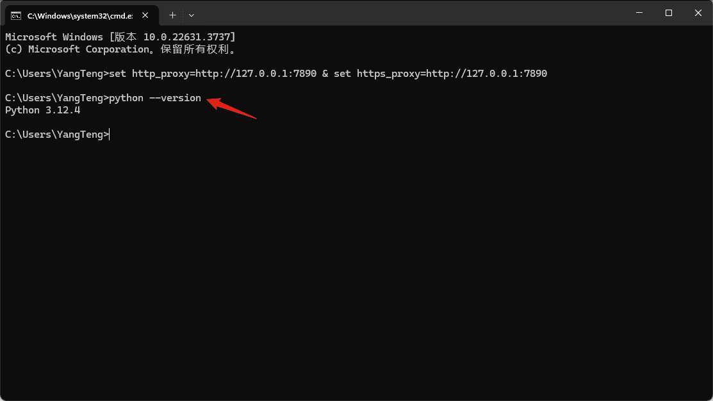
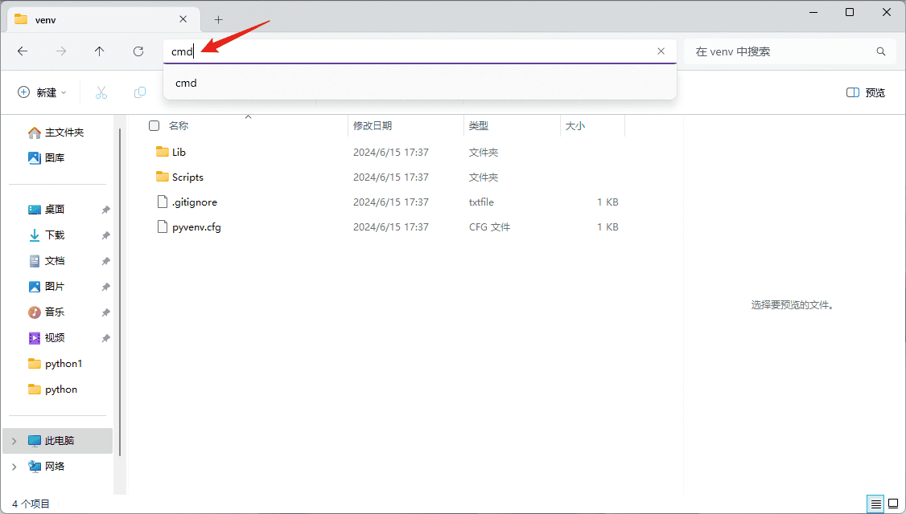
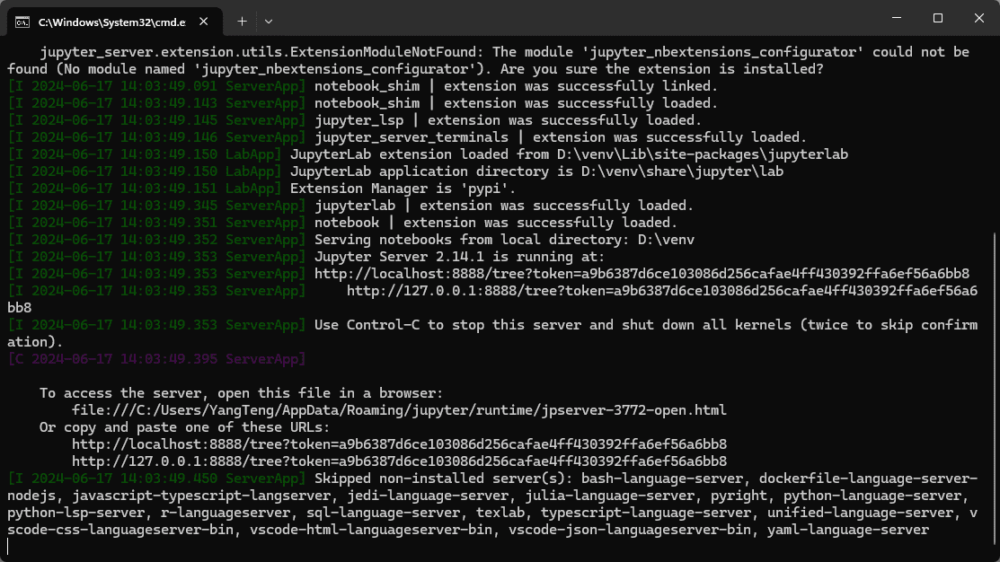
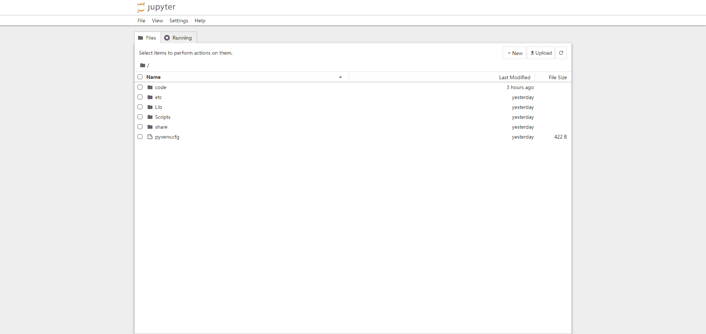

# TOC:

- [《1.Python环境搭建-20240619-V1.0》](#1-python环境搭建)
- [《2.基础资源》](#2-基础资源)

- - -

## 1. 《Python环境搭建》

- |文件版本|修订日期|修订人|审核人|批准人|修订说明|
  |:-:|:-:|:-:|:-:|:-:|:-:|
  |V1.0|2024/06/19|Lennon|Miang|Joel|初版|
  |||||||

### 目录

- [一、Python下载和安装](#一python下载和安装)
- [二、虚拟环境](#二虚拟环境)
- [三、Jupyter Notebook](#三jupyter-notebook)
- [四、每次使用](#四每次使用)

### 一、Python下载和安装

1. 打开Python的官方网址[Welcome to Python.org](https://www.python.org/) 

2. 根据实际需要下载相应的“安装程序”（一般选择Windows installer (64-bit)） 

3. 运行下载好的“安装程序”，确认选中下方的复选框，然后点击“Install Now” 

4. 点击“Disable path length limit”取消路径长度限制 

5. 快捷键“WIN+R”打开系统的“运行”窗口，输入“cmd”打开“命令提示符”窗口 

6. 输入“python --version”查看是否安装成功 

### 二、虚拟环境

1. 输入“pip install virtualenv”下载安装“虚拟环境库” 

2. 选定一个路径，然后打开“命令提示符”窗口 

3. 输入“virtualenv venv”创建一个名为“venv”的虚拟环境  

4. 进入虚拟环境的路径，然后打开“命令提示符”窗口 

5. 输入“.\Scripts\activate.bat”激活虚拟环境 

6. 命令提示符”窗口增加了“venv”前缀，表示当前处于名为“venv”的Python环境，即虚拟环境激活成功 

### 三、Jupyter Notebook

- 在虚拟环境中输入“pip install notebook”下载安装“Jupyter Notebook库”  

### 四、每次使用

1. 激活虚拟环境  

2. 输入“jupyter notebook”打开Jupyter Notebook   

- - -

## 2. 《基础资源》

### 目录

- [一、Python库](#一python库)
- [二、Proxy](#二proxy)
- [三、Anonymous Server](#三anonymous-server)

### 一、Python库

#### 1. 换源

- `pip install` <ins>`package`</ins> `-i` <ins>`source`</ins>  

- |Name|Url|
  |:-|:-|
  |清华|https://pypi.tuna.tsinghua.edu.cn/simple|
  |阿里云|http://mirrors.aliyun.com/pypi/simple|
  |中科大|http://pypi.mirrors.ustc.edu.cn/simple|
  |华为|https://repo.huaweicloud.com/repository/pypi/simple|
  |腾讯|http://mirrors.cloud.tencent.com/pypi/simple|

#### 2. 查看可安装版本

- `pip index versions` <ins>`package`</ins>

#### 3. 安装指定版本

- `pip install` <ins>`package==x.xx.xxx`</ins>

#### 4. 版本升级

- `pip install` <ins>`package`</ins> `--upgrade`

#### 5. 常用库

- |Name|Install|Reference|
  |:-|:-|:-:|
  |virtualenv|`pip install virtualenv`|[官网](https://virtualenv.pypa.io/en/latest/installation.html)|
  |jupyter notebook|`pip install notebook`|[官网](https://jupyter.org/install#jupyter-notebook)|
  |jupyterlab-language-pack-zh-CN|`pip install jupyterlab-language-pack-zh-CN`|[Python Package Index (PyPI)](https://pypi.org/project/jupyterlab-language-pack-zh-CN/)|
  |pandas|`pip install pandas`|[官网](https://pandas.pydata.org/docs/getting_started/index.html#getting-started)|
  |html5lib|`pip install html5lib`|[PyPI](https://pypi.org/project/html5lib/)|
  |BeautifulSoup|`pip install beautifulsoup4`|[官网](https://www.crummy.com/software/BeautifulSoup/bs4/doc/index.html#installing-beautiful-soup)|
  |parsel|`pip install parsel`|[PyPI](https://pypi.org/project/parsel/)|
  |openpyxl|`pip install openpyxl`|[官网](https://openpyxl.readthedocs.io/en/stable/tutorial.html)|
  |pillow|`pip install pillow`|[官网](https://pillow.readthedocs.io/en/latest/installation/basic-installation.html)|
  |tqdm|`pip install tqdm`|[PyPI](https://pypi.org/project/tqdm/)|
  |Scrapy|`pip install Scrapy`|[PyPI](https://pypi.org/project/Scrapy/)|
  |DrissionPage|`pip install DrissionPage`|[官网](https://drissionpage.cn/get_start/installation)|
  |gevent|`pip install gevent`|[官网](https://www.gevent.org/install.html)|
  |requests|`pip install requests`|[PyPI](https://pypi.org/project/requests/)|
  |lxml|`pip install lxml`|[官网](https://lxml.de/installation.html)|
  |selenium|`pip install selenium`|[官网](https://www.selenium.dev/documentation/webdriver/getting_started/install_library/) [ChromeDriver ](https://developer.chrome.com/docs/chromedriver) -> [Dashboard](https://googlechromelabs.github.io/chrome-for-testing/) [User-Agent](https://googlechromelabs.github.io/chrome-for-testing/known-good-versions.json)|

### 二、Proxy

- |Website|User|Password|
  |:-|:-:|:-:|
  |https://www.kuaidaili.com/login |deepseek0007@outlook.com|asdasd123|

### 三、Anonymous Server

1. |IP|User|Password|System|
   |:-|:-:|:-:|:-:|
   |152.32.150.9|root|deepseek110@|Centos7.6|
   |38.55.129.174|root|DG9n3In3Dnph|Centos7.6|
   |156.238.251.116|administrator|ktmvNGEA7235|Windows2022|

2. `nohup scrapy crawl` <ins>`crawler`</ins> `> /dev/null 2>&1 &`

3. `ps aux | grep scrapy`

4. `kill -9` <ins>`pid`</ins>
