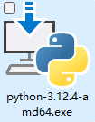
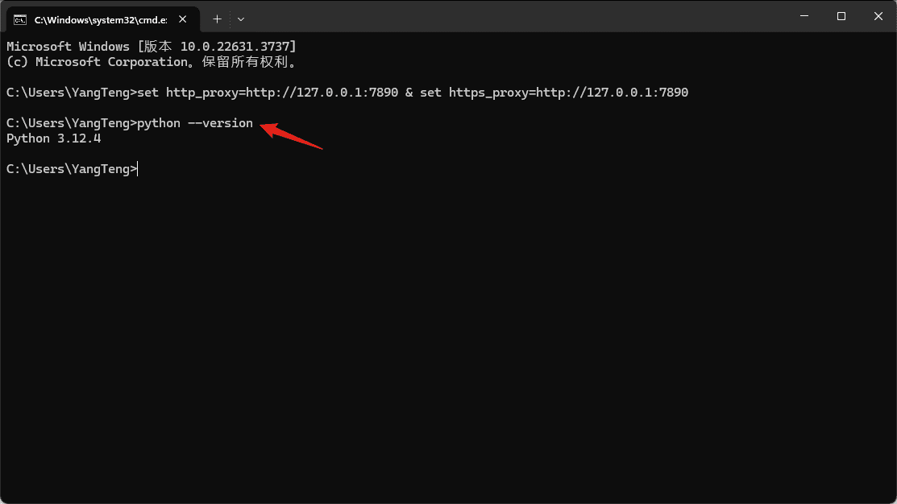
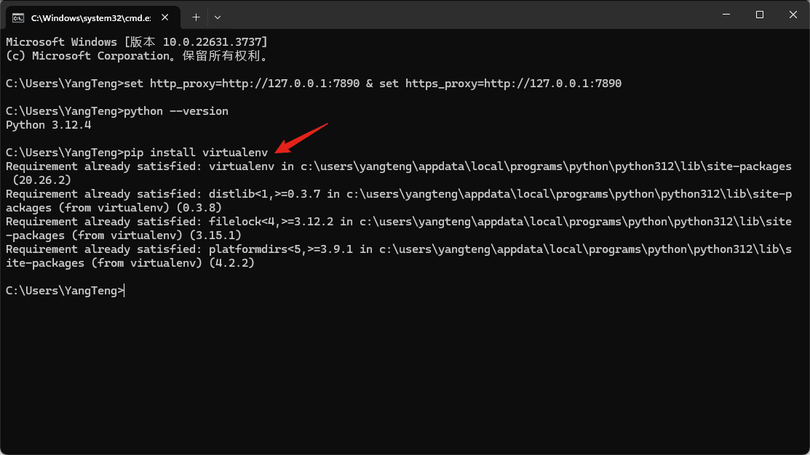
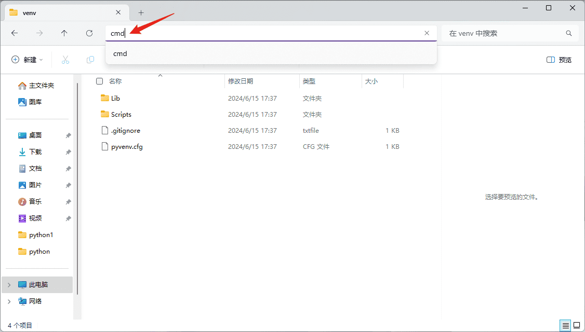
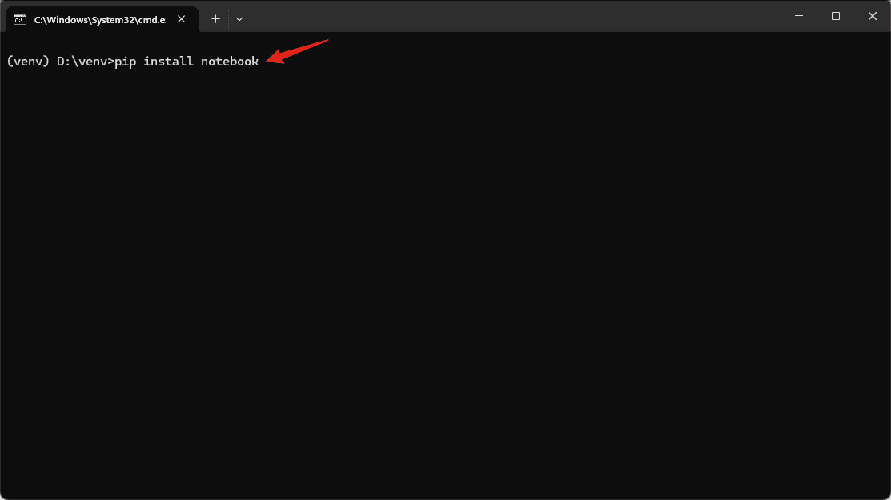
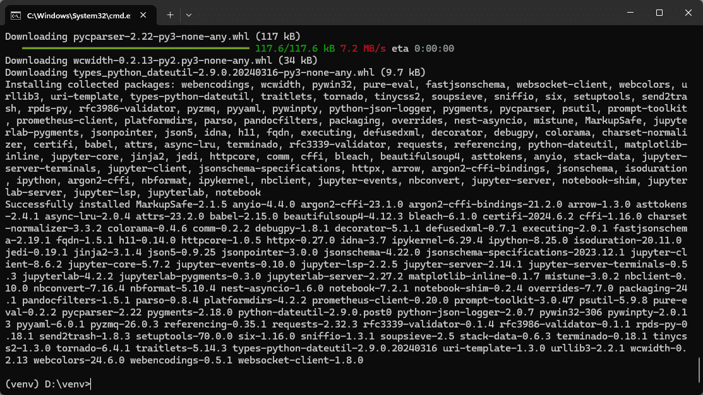
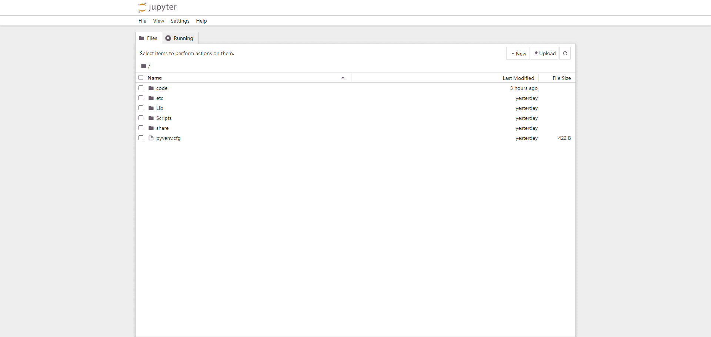

# 目录

- [1. 《采购中心爬虫需求处理流程规范》](#1-采购中心爬虫需求处理流程规范)
- [2. 《Python环境搭建》](#2-python环境搭建)

- - -

- - -

## 1. 《采购中心爬虫需求处理流程规范》

- |文件版本|修订日期|修订人|审核人|批准人|修订说明|
  |:-:|:-:|:-:|:-:|:-:|:-:|
  |V1.0|2024/09/04|Lennon|Miang|Joel|初版|
  |V1.1|2024/11/27|Lennon|Miang|Joel|明确细节|
  |||||||

### 目录

- [一、需求整理与提交](#一需求整理与提交)
- [二、邮件与附件格式](#二邮件与附件格式要求)
- [三、需求处理](#三需求处理流程)
- [四、其他事项](#四其他事项)

 

- 为提高爬虫需求处理的效率，确保信息传递的准确性及工作流程的规范性，现制定如下流程规范。请采购中心各事业部参照执行，并给予配合。

### 一、需求整理与提交

#### 1. 各事业部自行爬取：

- 对于已提供完整代码的简单网站，且事业部内已有爬虫负责人（如原数据部、船长办或其他有爬虫经验的同事），原则上由各事业部自行爬取。

- 如在操作过程中遇到技术问题，可联系Lennon提供技术支持。

#### 2. 邮件提交需求：

- 对于其他较为复杂的网站爬虫需求，请各位自行将需求整理清晰，并将其以Excel文件形式作为附件，发送至Lennon，同时抄送本部门部长及Joel。

### 二、邮件与附件格式要求

#### 1. 邮件主题：

- 请确保邮件主题包含“【爬虫需求】+部门名称+简要描述”，例如：“【爬虫需求】项目投放部 - Steering Damper”。

#### 2. 邮件正文：

- 需求描述：简要描述爬虫任务目标及所需数据。

- 时间要求：明确需求的完成时间或紧急程度。若无紧急要求，建议预留至少一周时间；如为紧急需求，请详细说明项目进度，以便合理安排优先级。

- 其他说明：包括文件输出样式、文件体积等特殊要求。

#### 3. Excel附件格式要求：

- 附件中的Excel文件应简洁明了，包含以下内容：第一列为需求序号；第二列为目标网址。 

- 请确保每个需求都有明确的网址，避免“爬一下Dorman 家的卡扣”这种含糊不清的描述。网址应直接指向需要抓取的具体页面，避免仅提供网站主页地址。

### 三、需求处理流程

#### 1. 需求处理：

- Lennon收到需求后会进行初步评估，并在必要时进一步沟通并细化需求。

- 一旦需求确认，数据部将根据优先级安排任务，并尽力在规定时间内完成。

- 爬虫任务完成后，数据部将通过邮件反馈爬取的结果。

#### 2. 查重处理：

- 如无特殊要求，请各事业部自行完成查重工作。

- 若有特殊查重需求，请在邮件正文中详细说明，并将邮件抄送 Nolan。

- 请确保查重需求明确，包括但不限于：需要与哪个品类进行数据库查重、表内重复项是否保留以及相应的保留规则等，避免如“查重、去重”这种不明确的表述。

### 四、其他事项

- 提交需求时，请确保信息准确无误，避免因描述不清导致的处理延误。

- 数据部将对每项爬虫需求进行记录，并定期向采购中心领导汇报进展情况。

- 如有紧急需求或特殊事项，请提前告知Lennon，以便及时协调处理。

- - -

- - -

## 2. 《Python环境搭建》

- |文件版本|修订日期|修订人|审核人|批准人|修订说明|
  |:-:|:-:|:-:|:-:|:-:|:-:|
  |V1.0|2024/06/19|Lennon|Miang|Joel|初版|
  |||||||

### 目录

- [一、Python下载和安装](#一python下载和安装)
- [二、虚拟环境](#二虚拟环境)
- [三、Jupyter Notebook](#三jupyter-notebook)
- [四、每次使用](#四每次使用)

### 一、Python下载和安装

1. 打开Python的官方网址[Welcome to Python.org](https://www.python.org/) 

2. 根据实际需要下载相应的“安装程序”（一般选择Windows installer (64-bit)） 

3. 运行下载好的“安装程序”，确认选中下方的复选框，然后点击“Install Now” 

4. 点击“Disable path length limit”取消路径长度限制 

5. 快捷键“WIN+R”打开系统的“运行”窗口，输入“cmd”打开“命令提示符”窗口 

6. 输入“python --version”查看是否安装成功 

### 二、虚拟环境

1. 输入“pip install virtualenv”下载安装“虚拟环境包” 

2. 选定一个路径，然后打开“命令提示符”窗口 

3. 输入“virtualenv venv”创建一个名为“venv”的虚拟环境  

4. 进入虚拟环境的路径，然后打开“命令提示符”窗口 

5. 输入“.\Scripts\activate.bat”激活虚拟环境 

6. 命令提示符”窗口增加了“venv”前缀，表示当前处于名为“venv”的Python环境，即虚拟环境激活成功 

### 三、Jupyter Notebook

- 在虚拟环境中输入“pip install notebook”下载安装“Jupyter Notebook包”  

### 四、每次使用

1. 激活虚拟环境  

2. 输入“jupyter notebook”打开Jupyter Notebook   
  