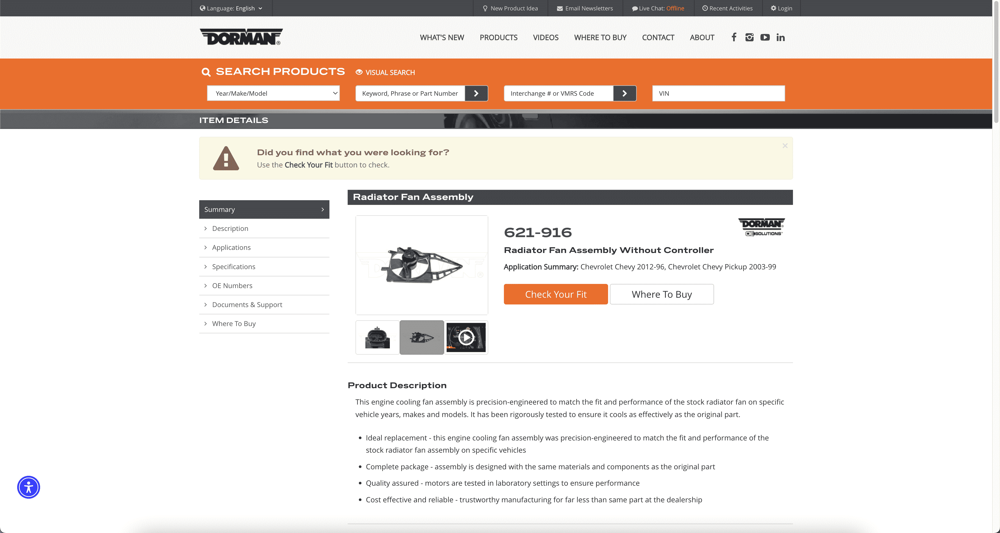
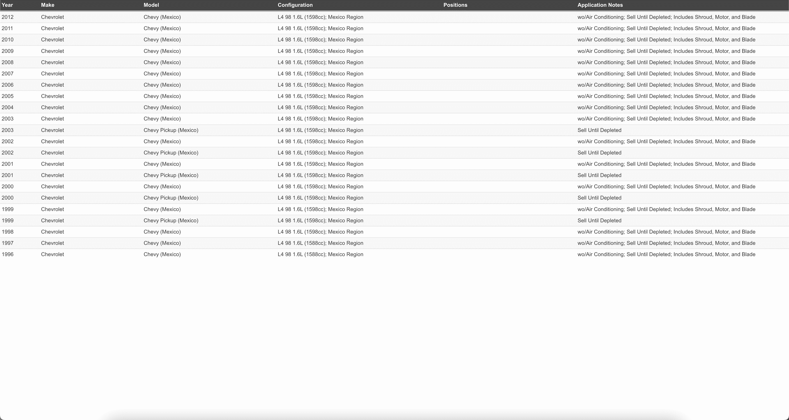
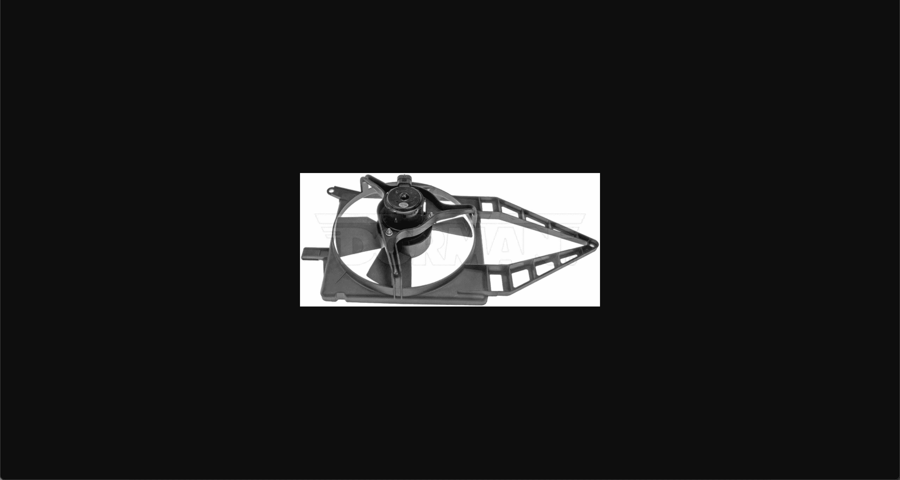

# TOC:

- [1. Page](#1-page)
- [2. Url](#2-url)
- [3. Part](#3-part)
- [4. Compatibility](#4-compatibility)
- [5. Picture](#5-picture)

- - -

## 1. Page

- Url: https://www.dormanproducts.com/gsearch.aspx?type=keyword&origin=keyword&parttype=Radiator%2520Fan%2520Assembly&start=0&num=100
- Picture: 
- Field:
  - **sku_count**: `750`
  - **page_count**: `8`
  - **page**: `1`
  - **page_url**: `'https://www.dormanproducts.com/gsearch.aspx?type=keyword&origin=keyword&parttype=Radiator%2520Fan%2520Assembly&start=0&num=100'`

## 2. Url

- Url: https://www.dormanproducts.com/gsearch.aspx?type=keyword&origin=keyword&parttype=Radiator%2520Fan%2520Assembly&start=0&num=100
- Picture: 
- Field:
  - **no**: `1`
  - **url**: `'https://www.dormanproducts.com/p-106000-621-965.aspx?parttype=Radiator%2520Fan%2520Assembly&origin=keyword'`

## 3. Part

- Url: https://www.dormanproducts.com/p-106000-621-965.aspx?parttype=Radiator%2520Fan%2520Assembly&origin=keyword
- Picture:   
- Field:
  - **type_**: `'Radiator Fan Assembly'`
  - **json_src**: `'{"0": "https://static.dormanproducts.com/images/product/medium/621-965-007.JPG", "1": "https://static.dormanproducts.com/images/product/medium/621-965-009.JPG", "2": "https://static.dormanproducts.com/images/product/medium/621-965-003.JPG", "3": "https://static.dormanproducts.com/images/product/medium/621-965-002.JPG"}'`
  - **brand**: `'Dorman - OE Solutions'`
  - **part_number**: `'621-965'`
  - **description**: `'Radiator Fan Assembly Without Controller'`
  - **application_summary**: `'Nissan Sentra 2000-96, Nissan Tsuru 2017-10, 2006-96'`
  - **warning**: `''`
  - **compatibility_home**: `'https://www.dormanproducts.com/itemdetailapp.aspx?ProductID=106000&PartType=Radiator+Fan+Assembly&start=0&num=50'`
  - **json_specification**: `'{"Blade Material": "Plastic", "Blade Type": "Forward Align Fin", "Connector Gender": "Female", "Connector Quantity": "1", "Diameter": "300 mm", "Electrical Or Mechanical": "Electrical", "Fan 1 Blade Quantity": "1", "Fan 1 Diameter": "300 mm", "Fan 2 Blade Quantity": "0", "Fan Quantity": "1", "Fan Rotation": "Clockwise (Right)", "Flat Side On Shaft": "No", "Grade Type": "Regular", "Motor Type": "Brushed", "Package Contents": "1 Radiator Fan Assembly", "Package Quantity": "1", "Packaging Type": "Box", "Shaft Diameter": "5 mm", "Shroud Color": "Black", "Shroud Included": "Yes", "Shroud Material": "Plastic", "Terminal Gender": "Female", "Terminal Quantity": "2", "Voltage": "13.6 VDC"}'`
  - **oem**: `'21481F430A'`

## 4. Compatibility

- Url: https://www.dormanproducts.com/itemdetailapp.aspx?ProductID=106000&PartType=Radiator+Fan+Assembly&start=0&num=50
- Picture: 
- Field:
  - **compatibility_page**: `1`
  - **compatibility_url**: `'https://www.dormanproducts.com/itemdetailapp.aspx?ProductID=106000&PartType=Radiator+Fan+Assembly&start=0&num=50'`
  - **compatibility_no**: `1`
  - **Year**: `'2017'`
  - **Make**: `'Nissan'`
  - **Model**: `'Tsuru (Mexico)'`
  - **Configuration**: `'L4 97 1.6L (1597cc); Mexico Region; Manual Trans.'`
  - **Positions**: `''`
  - **Application Notes**: `''`

## 5. Picture

- Url: https://static.dormanproducts.com/images/product/medium/621-965-007.JPG
- Picture: 
