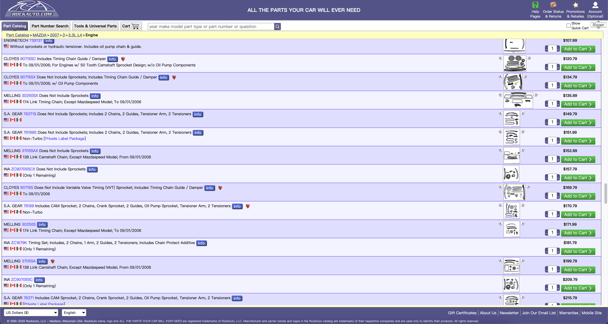
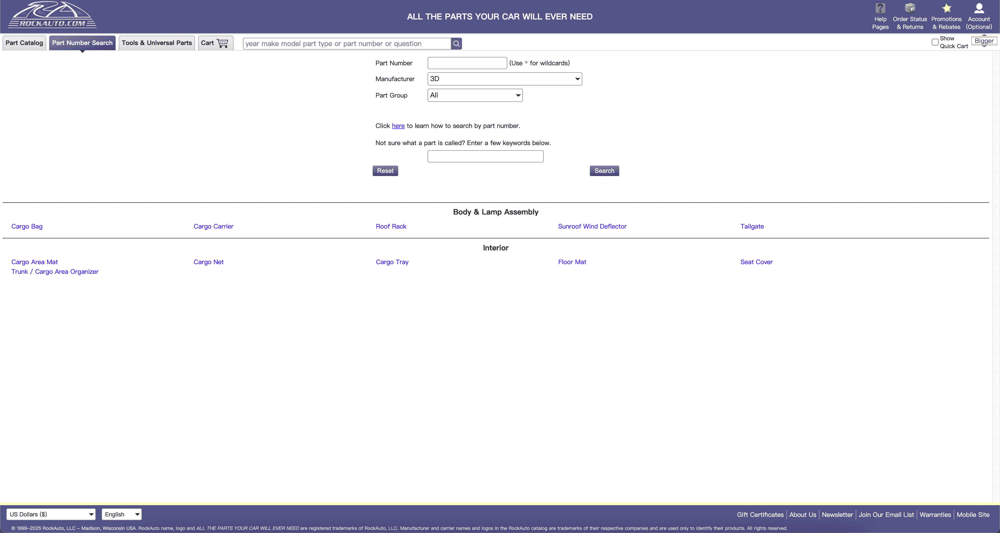
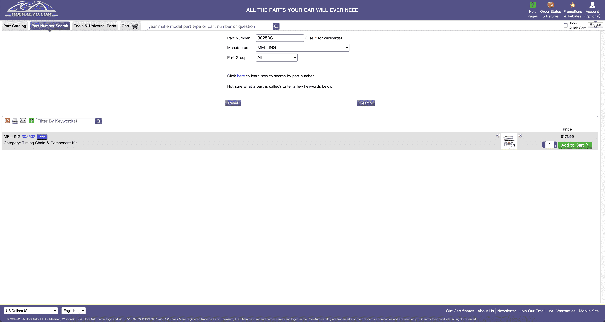
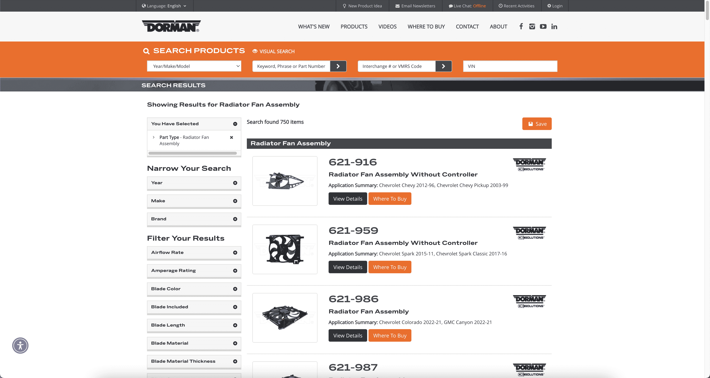
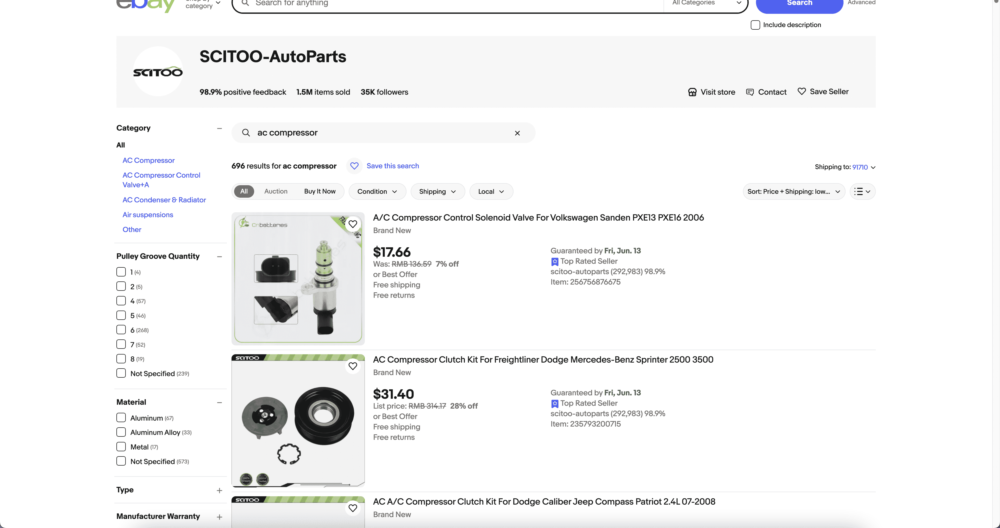
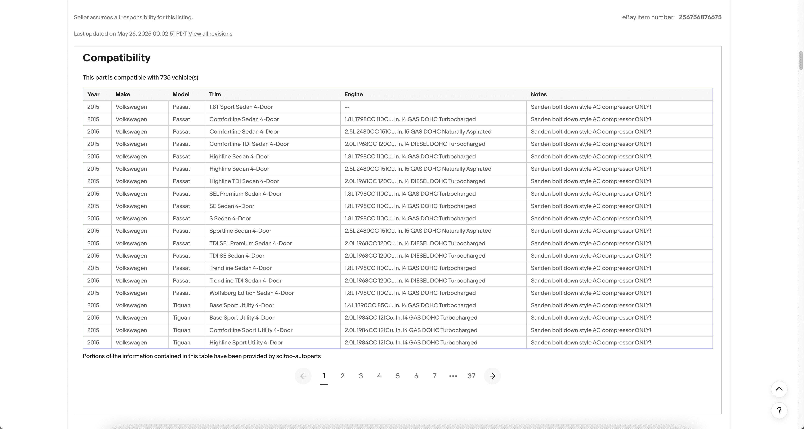
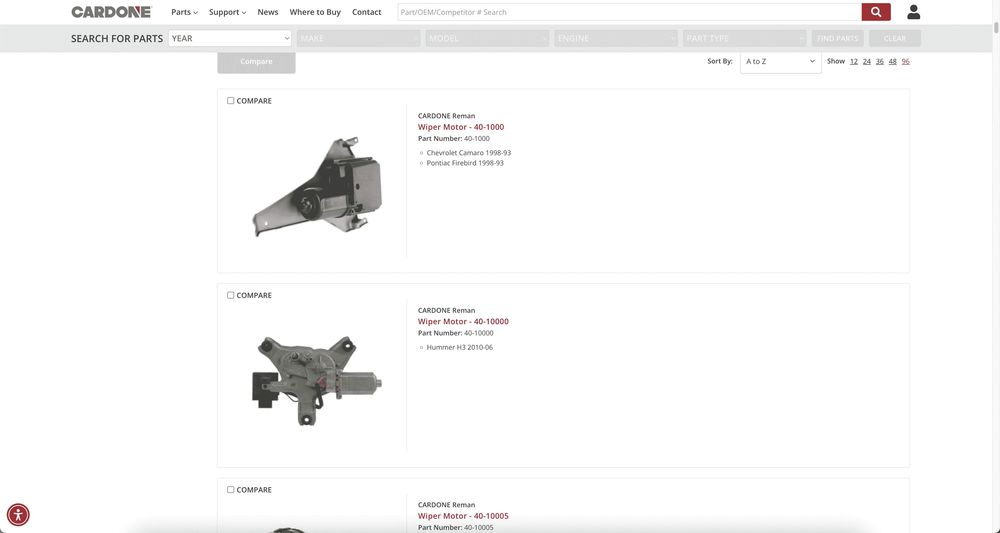
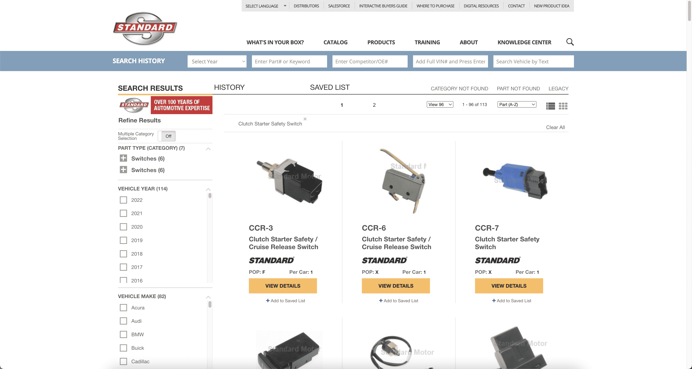
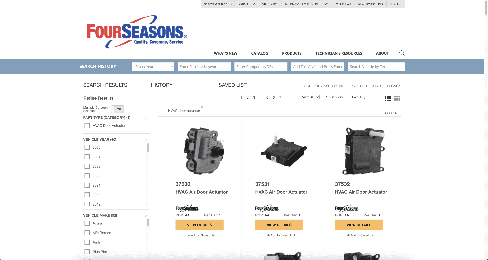
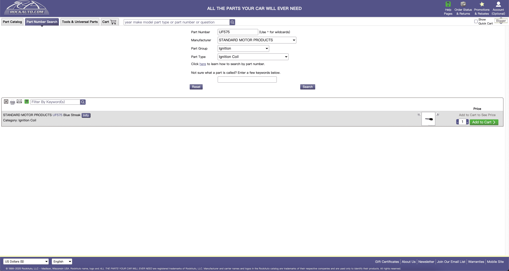

# TOC:

- [0. Picture](#0-picture)
- [1. RockAuto](#1-rockauto)
- [1. RockAuto-2](#1-rockauto-2)
- [1. RockAuto-3](#1-rockauto-3)
- [1. RockAuto-4](#1-rockauto-4)
- [2. Dorman](#2-dorman)
- [3. eBay](#3-ebay)
- [3. eBay-Compatibility](#3-ebay-compatibility)
- [4. Cardone](#4-cardone)
- [5. Standard](#5-standard)
- [9. FourSeasons](#9-fourseasons)
- [10. Amazon](#10-amazon)
- [51. OnlineCarParts-2](#51-onlinecarparts-2)
- [52. DongCheDi](#52-dongchedi)
- [Leif-1. RockAuto-1](#leif-1-rockauto-1)

- - -

## 0. Picture

1. [Example](https://www.rockauto.com/info/583/3-0250S-1-KIT.jpg) 
2. [Detail](./code/0)

- - -

## 1. [RockAuto](https://www.rockauto.com/)

1. [Example](https://www.rockauto.com/en/parts/melling,timing+chain+&+component+kit,5756) 
2. [Detail](./code/1)

- - -

## 1. [RockAuto-2](https://www.rockauto.com/)

1. [Example](https://www.rockauto.com/en/catalog/MAZDA,2007,3,2.3L%20L4,1434568,Lennon,Lennon,5756) 
2. [Detail](./code/1-2)

- - -

## 1. [RockAuto-3](https://www.rockauto.com/)

1. [Example](https://www.rockauto.com/en/parts/3d,cargo+bag,1263) 
2. [Detail](./code/1-3)

- - -

## 1. [RockAuto-4](https://www.rockauto.com/en/parts/MELLING,30250S,Lennon,)

1. Feature: `manufacturer`、`part_number`
2. [Example](https://www.rockauto.com/en/parts/melling,timing+chain+&+component+kit,5756) 
3. [Detail](./code/1-4)

- - -

## 2. [Dorman](https://www.dormanproducts.com/)

1. [Example](https://www.dormanproducts.com/gsearch.aspx?type=keyword&origin=keyword&parttype=Radiator%2520Fan%2520Assembly&start=0&num=100) 
2. [Detail](./code/2)

- - -

## 3. [eBay](https://www.ebay.com/)

1. [Example](https://www.ebay.com/sch/i.html?_dkr=1&iconV2Request=true&_blrs=recall_filtering&_ssn=scitoo-autoparts&store_cat=0&store_name=cnbatteries&_oac=1&_nkw=ac+compressor&_stpos=91710&_fcid=1&_sop=15) 
2. [Detail](./code/3)

- - -

## 3. [eBay-Compatibility](https://www.ebay.com/)

1. [Example](https://www.ebay.com/itm/256756876675?_ul=US&_stpos=91710&orig_cvip=true) 
2. [Detail](./code/3-Compatibility)

- - -

## 4. [Cardone](https://www.cardone.com/)

1. [Example](https://www.cardone.com/motors/wiper-and-washer/windshield-wiper-motor/?pageSize=96&sort=name&page=1) 
2. [Detail](./code/4)

- - -

## 5. [Standard](https://www.standardbrand.com/en)

1. [Example](https://www.standardbrand.com/en/ecatalog?part=Clutch%20Starter%20Safety%20Switch&type=p) 
2. [Detail](./code/5)

- - -

## 9. [FourSeasons](https://www.4s.com/en)

1. [Example](https://www.4s.com/en/ecatalog?part=HVAC%20door%20actuator&type=p&search=s) 
2. [Detail](./code/9)

- - -

## 10. [Amazon](https://www.amazon.com/)

1. [Example](https://www.amazon.com/gp/bestsellers/automotive/ref=pd_zg_ts_automotive?language=en_US) 
2. [Detail](./code/10)

- - -

## 51. [OnlineCarParts-2](https://www.onlinecarparts.co.uk/)

1. [Example](https://www.onlinecarparts.co.uk/kyb-828666.html) 
2. [Detail](./code/51-2)

- - -

## 52. [DongCheDi](https://www.dongchedi.com/)

1. [Example](https://www.dongchedi.com/auto/library-brand/x) 
2. [Detail](./code/52)

- - -

## Leif-1. [RockAuto-1](https://www.rockauto.com/)

1. [Example](https://www.rockauto.com/en/parts/STANDARD%20MOTOR%20PRODUCTS,UF575,Leif,7060) 
2. [Detail](./code/Leif/1-1)

- - -

- - -

- - -
