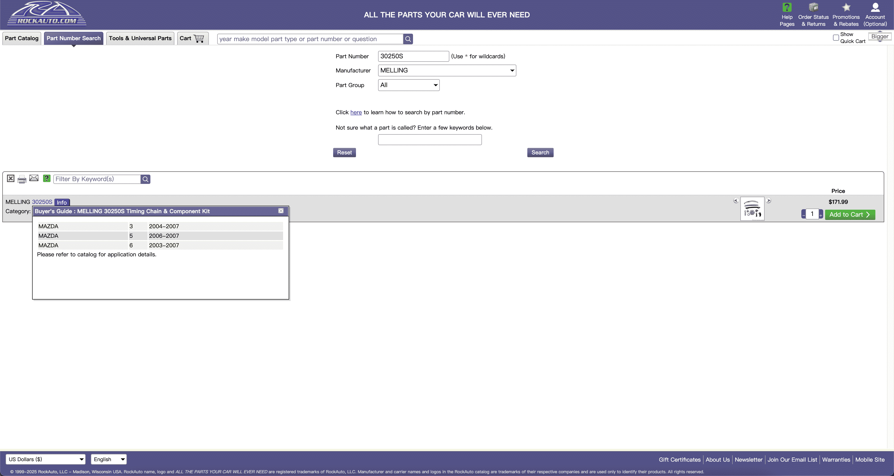
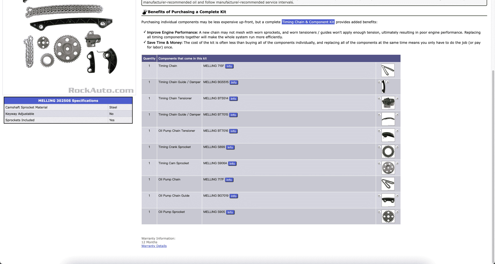
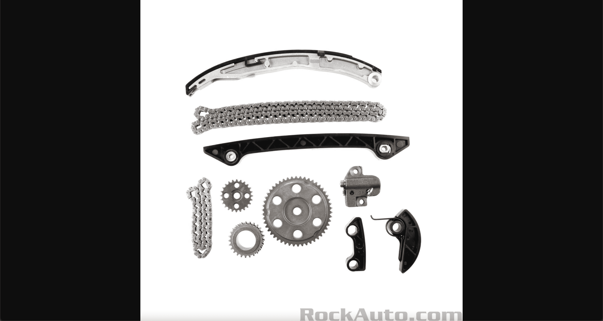

# TOC:

- [1. Part](#1-part)
- [2. Compatibility](#2-compatibility)
- [3. Specification](#3-specification)
- [4. Picture](#4-picture)

- - -

## 1. Part

- Url: <https://www.rockauto.com/en/parts/MELLING,30250S,Lennon,>
- Picture: 
- Field:
  - **part_no**: `1`
  - **type_code**: `'5756'`
  - **url**: `'https://www.rockauto.com/en/parts/MELLING,30250S,Lennon,5756'`
  - **part_code**: `'8304960'`
  - **join_mpntcpc**: `'MELLING;30250S;5756;8304960'`
  - **choose**: `''`
  - **json_sidenote**: `'{}'`
  - **info_url**: `'https://www.rockauto.com/en/moreinfo.php?pk=8304960&cc=0&pt=5756'`
  - **json_footnote**: `'{"0": "Category: Timing Chain & Component Kit"}'`
  - **oem**: `''`
  - **json_src**: `'{"0": "https://www.rockauto.com/info/583/3-0250S-1-KIT.jpg", "1": "https://www.rockauto.com/info/583/BT7015-2-SID.jpg", "2": "https://www.rockauto.com/info/583/BG5515-3-FRO.jpg", "3": "https://www.rockauto.com/info/583/715F-1-ANG.jpg", "4": "https://www.rockauto.com/info/583/BT5514-1-ANG.jpg", "5": "https://www.rockauto.com/info/583/S906A-1-FRO.jpg", "6": "https://www.rockauto.com/info/583/717F-1-ANG.jpg", "7": "https://www.rockauto.com/info/583/BT7016-1-TOP.jpg", "8": "https://www.rockauto.com/info/583/S899-1-FRO.jpg", "9": "https://www.rockauto.com/info/583/S905-1-FRO.jpg", "10": "https://www.rockauto.com/info/583/BG7019-2-SID.jpg"}'`
  - **json_price**: `'{"default": "$171.99"}'`

## 2. Compatibility

- Url: https://www.rockauto.com/en/parts/MELLING,30250S,Lennon,5756
- Picture: 
- Field:
  - **compatibility_no**: `1`
  - **make**: `'MAZDA'`
  - **model**: `'3'`
  - **year**: `'2004-2007'`

## 3. Specification

- Url: https://www.rockauto.com/en/parts/MELLING,30250S,Lennon,5756
- Picture: 
- Field:
  - **json_specification**: `'{"Camshaft Sprocket Material": "Steel", "Keyway Adjustable": "No", "Sprockets Included": "Yes"}'`
  - **json_kit**: `'{"0": {"kit_quantity": 1, "kit_type": "Timing Chain", "kit_type_code": "5724", "kit_part_code": "8306448", "kit_part_number": "715F", "kit_manufacturer": "MELLING", "kit_url": "https://www.rockauto.com/en/parts/MELLING,715F,Timing Chain,5724&Lennon=1", "kit_join_mpntcpc": "MELLING;715F;5724;8306448", "kit_info_url": "https://www.rockauto.com/en/moreinfo.php?pk=8306448&cc=0&pt=5724", "kit_dict_src": {"0": "https://www.rockauto.com/info/583/715F-1-ANG.jpg"}}, "1": {"kit_quantity": 1, "kit_type": "Timing Chain Guide / Damper", "kit_type_code": "5728", "kit_part_code": "8307424", "kit_part_number": "BG5515", "kit_manufacturer": "MELLING", "kit_url": "https://www.rockauto.com/en/parts/MELLING,BG5515,Timing Chain Guide / Damper,5728&Lennon=1", "kit_join_mpntcpc": "MELLING;BG5515;5728;8307424", "kit_info_url": "https://www.rockauto.com/en/moreinfo.php?pk=8307424&cc=0&pt=5728", "kit_dict_src": {"0": "https://www.rockauto.com/info/583/BG5515-3-FRO.jpg", "1": "https://www.rockauto.com/info/583/BG5515-1-TOP.jpg", "2": "https://www.rockauto.com/info/583/BG5515-2-BOT.jpg", "3": "https://www.rockauto.com/info/583/BG5515-4-BAC.jpg"}}, "2": {"kit_quantity": 1, "kit_type": "Timing Chain Tensioner", "kit_type_code": "5736", "kit_part_code": "8308132", "kit_part_number": "BT5514", "kit_manufacturer": "MELLING", "kit_url": "https://www.rockauto.com/en/parts/MELLING,BT5514,Timing Chain Tensioner,5736&Lennon=1", "kit_join_mpntcpc": "MELLING;BT5514;5736;8308132", "kit_info_url": "https://www.rockauto.com/en/moreinfo.php?pk=8308132&cc=0&pt=5736", "kit_dict_src": {"0": "https://www.rockauto.com/info/583/BT5514-1-ANG.jpg", "1": "https://www.rockauto.com/info/583/BT5514-2-TOP.jpg"}}, "3": {"kit_quantity": 1, "kit_type": "Timing Chain Guide / Damper", "kit_type_code": "5728", "kit_part_code": "8308292", "kit_part_number": "BT7015", "kit_manufacturer": "MELLING", "kit_url": "https://www.rockauto.com/en/parts/MELLING,BT7015,Timing Chain Guide / Damper,5728&Lennon=1", "kit_join_mpntcpc": "MELLING;BT7015;5728;8308292", "kit_info_url": "https://www.rockauto.com/en/moreinfo.php?pk=8308292&cc=0&pt=5728", "kit_dict_src": {"0": "https://www.rockauto.com/info/583/BT7015-2-SID.jpg", "1": "https://www.rockauto.com/info/583/BT7015-1-TOP.jpg"}}, "4": {"kit_quantity": 1, "kit_type": "Oil Pump Chain Tensioner", "kit_type_code": "11860", "kit_part_code": "8308296", "kit_part_number": "BT7016", "kit_manufacturer": "MELLING", "kit_url": "https://www.rockauto.com/en/parts/MELLING,BT7016,Oil Pump Chain Tensioner,11860&Lennon=1", "kit_join_mpntcpc": "MELLING;BT7016;11860;8308296", "kit_info_url": "https://www.rockauto.com/en/moreinfo.php?pk=8308296&cc=0&pt=11860", "kit_dict_src": {"0": "https://www.rockauto.com/info/583/BT7016-1-TOP.jpg", "1": "https://www.rockauto.com/info/583/BT7016-2-SID.jpg"}}, "5": {"kit_quantity": 1, "kit_type": "Timing Crank Sprocket", "kit_type_code": "5723", "kit_part_code": "8314844", "kit_part_number": "S899", "kit_manufacturer": "MELLING", "kit_url": "https://www.rockauto.com/en/parts/MELLING,S899,Timing Crank Sprocket,5723&Lennon=1", "kit_join_mpntcpc": "MELLING;S899;5723;8314844", "kit_info_url": "https://www.rockauto.com/en/moreinfo.php?pk=8314844&cc=0&pt=5723", "kit_dict_src": {"0": "https://www.rockauto.com/info/583/S899-1-FRO.jpg", "1": "https://www.rockauto.com/info/583/S899-2-BAC.jpg", "2": "https://www.rockauto.com/info/583/S899-3-ANG.jpg"}}, "6": {"kit_quantity": 1, "kit_type": "Timing Cam Sprocket", "kit_type_code": "5722", "kit_part_code": "8314860", "kit_part_number": "S906A", "kit_manufacturer": "MELLING", "kit_url": "https://www.rockauto.com/en/parts/MELLING,S906A,Timing Cam Sprocket,5722&Lennon=1", "kit_join_mpntcpc": "MELLING;S906A;5722;8314860", "kit_info_url": "https://www.rockauto.com/en/moreinfo.php?pk=8314860&cc=0&pt=5722", "kit_dict_src": {"0": "https://www.rockauto.com/info/583/S906A-1-FRO.jpg", "1": "https://www.rockauto.com/info/583/S906A-2-BAC.jpg", "2": "https://www.rockauto.com/info/583/S906A-3-ANG.jpg"}}, "7": {"kit_quantity": 1, "kit_type": "Oil Pump Chain", "kit_type_code": "5568", "kit_part_code": "8527968", "kit_part_number": "717F", "kit_manufacturer": "MELLING", "kit_url": "https://www.rockauto.com/en/parts/MELLING,717F,Oil Pump Chain,5568&Lennon=1", "kit_join_mpntcpc": "MELLING;717F;5568;8527968", "kit_info_url": "https://www.rockauto.com/en/moreinfo.php?pk=8527968&cc=0&pt=5568", "kit_dict_src": {"0": "https://www.rockauto.com/info/583/717F-1-ANG.jpg"}}, "8": {"kit_quantity": 1, "kit_type": "Oil Pump Chain Guide", "kit_type_code": "11859", "kit_part_code": "8921276", "kit_part_number": "BG7019", "kit_manufacturer": "MELLING", "kit_url": "https://www.rockauto.com/en/parts/MELLING,BG7019,Oil Pump Chain Guide,11859&Lennon=1", "kit_join_mpntcpc": "MELLING;BG7019;11859;8921276", "kit_info_url": "https://www.rockauto.com/en/moreinfo.php?pk=8921276&cc=0&pt=11859", "kit_dict_src": {"0": "https://www.rockauto.com/info/583/BG7019-2-SID.jpg", "1": "https://www.rockauto.com/info/583/BG7019-1-TOP.jpg"}}, "9": {"kit_quantity": 1, "kit_type": "Oil Pump Sprocket", "kit_type_code": "5589", "kit_part_code": "8921472", "kit_part_number": "S905", "kit_manufacturer": "MELLING", "kit_url": "https://www.rockauto.com/en/parts/MELLING,S905,Oil Pump Sprocket,5589&Lennon=1", "kit_join_mpntcpc": "MELLING;S905;5589;8921472", "kit_info_url": "https://www.rockauto.com/en/moreinfo.php?pk=8921472&cc=0&pt=5589", "kit_dict_src": {"0": "https://www.rockauto.com/info/583/S905-1-FRO.jpg", "1": "https://www.rockauto.com/info/583/S905-2-BAC.jpg", "2": "https://www.rockauto.com/info/583/S905-3-ANG.jpg"}}}'`

## 4. Picture

- Url: https://www.rockauto.com/info/583/3-0250S-1-KIT.jpg
- Picture: 
