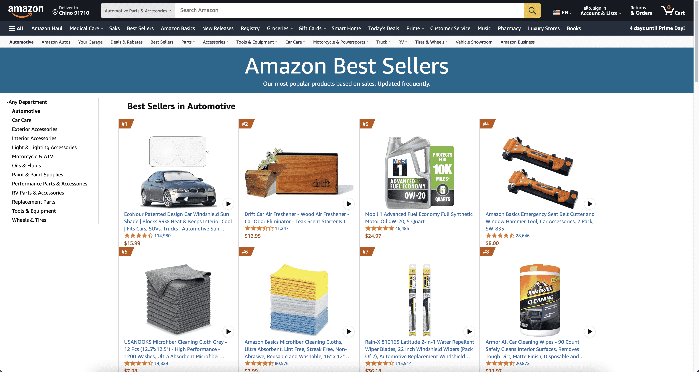
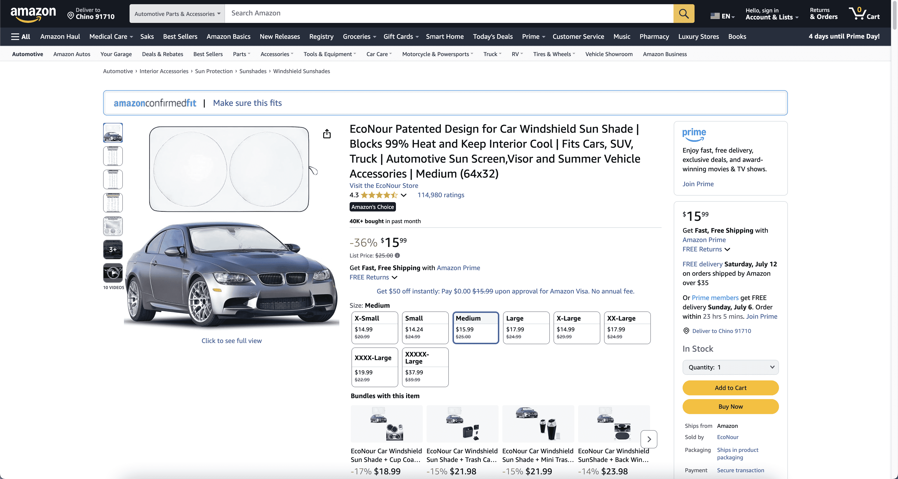
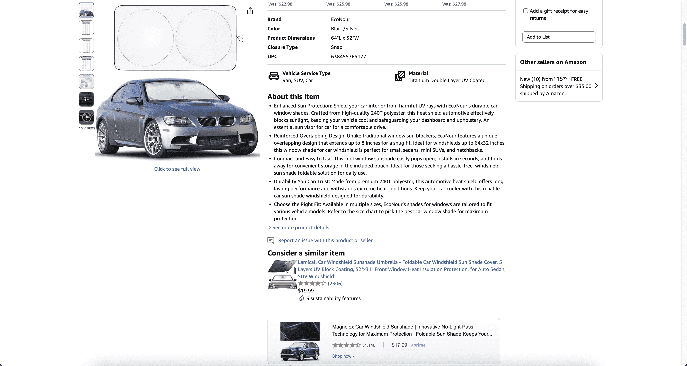
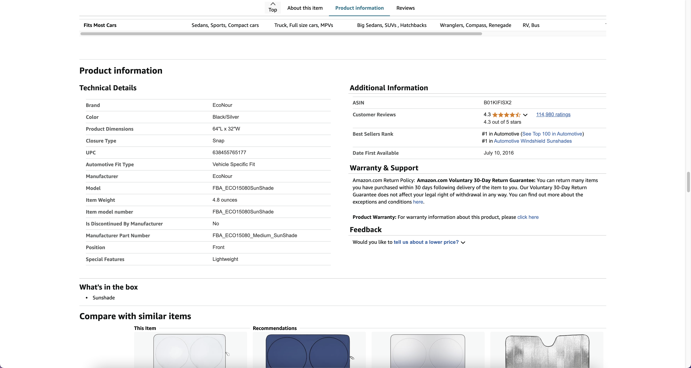
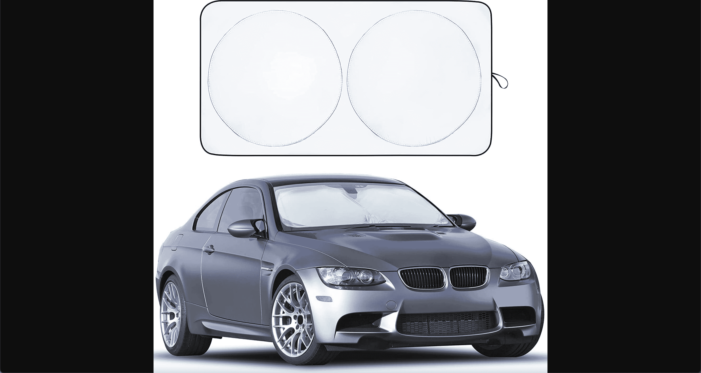

# TOC:

- [1. Asin](#1-asin)
- [2. Part](#2-part)
- [3. Picture](#3-picture)

- - -

## 1. Asin

- Url: https://www.amazon.com/gp/bestsellers/automotive/ref=pd_zg_ts_automotive?language=en_US
- Picture: 
- Field:
  - **page**: `1`
  - **asin**: `'B01KIFISX2'`
  - **rank**: `1`
  - **url**: `'https://www.amazon.com//dp/B01KIFISX2'`

## 2. Part

- Url: https://www.amazon.com//dp/B01KIFISX2
- Picture:   
- Field:
  - **url**: `'https://www.amazon.com/gp/bestsellers/automotive/3147717011/ref=pd_zg_hrsr_automotive'`
  - **asin_real**: `'B01KIFISX2'`
  - **match**: `'true'`
  - **zip_code**: `'Chino 91710'`
  - **price**: `'$15.99'`
  - **json_overview**: `'{"Brand": "EcoNour", "Color": "Black/Silver", "Product Dimensions": "64\\"L x 32\\"W", "Closure Type": "Snap", "UPC": "638455765177", "Vehicle Service Type": "Van, SUV, Car", "Material": "Titanium Double Layer UV Coated"}'`
  - **about**: `'1. Enhanced Sun Protection: Shield your car interior from harmful UV rays with EcoNour’s durable car window shades. Crafted from high-quality 240T polyester, this heat shield automotive effectively blocks sunlight, keeping your vehicle cool and safeguarding your dashboard and upholstery. An essential sun visor for car for a comfortable drive.\n2. Reinforced Overlapping Design: Unlike traditional window sun blockers, EcoNour features a unique overlapping design that extends up to 8 inches for a snug fit. Ideal for windshields up to 64x32 inches, this window shade for car windshield is perfect for small sedans, mini SUVs, and hatchbacks.\n3. Compact and Easy to Use: This cool window sunshade easily pops open, installs in seconds, and folds away for convenient storage in the included pouch. Ideal for those seeking a hassle-free, windshield sun shade foldable solution for daily use.\n4. Durability You Can Trust: Made from premium 240T polyester, this automotive heat shield offers long-lasting performance and withstands extreme heat conditions. Keep your car cooler with this reliable car sun shade windshield designed for durability.\n5. Choose the Right Fit: Available in multiple sizes, EcoNour’s shades for windows are tailored to fit various vehicle models. Refer to the size chart to pick the best car window shade for maximum protection.'`
  - **select**: `'Medium'`
  - **json_src**: `'{"0": "https://m.media-amazon.com/images/I/71W3+eLCARL._AC_SL1500_.jpg", "1": "https://m.media-amazon.com/images/I/81WAkP+VSLL._AC_SL1500_.jpg", "2": "https://m.media-amazon.com/images/I/810WLduvaAL._AC_SL1500_.jpg", "3": "https://m.media-amazon.com/images/I/71eUie948cL._AC_SL1500_.jpg", "4": "https://m.media-amazon.com/images/I/81NXLEQMW1L._AC_SL1500_.jpg", "5": "https://m.media-amazon.com/images/I/61JxpXx+E8L._AC_.jpg", "6": "https://m.media-amazon.com/images/I/61saVQOtROL._AC_.jpg", "7": "https://m.media-amazon.com/images/I/81a1t0CDuXL._AC_SL1500_.jpg"}'`
  - **title**: `'EcoNour Patented Design for Car Windshield Sun Shade | Blocks 99% Heat and Keep Interior Cool | Fits Cars, SUV, Truck | Automotive Sun Screen,Visor and Summer Vehicle Accessories | Medium (64x32)'`
  - **parent_asin**: `'B0DRNCGR4H'`
  - **json_information**: `'{"Brand": "EcoNour", "Color": "Black/Silver", "Product Dimensions": "64\\"L x 32\\"W", "Closure Type": "Snap", "UPC": "638455765177", "Automotive Fit Type": "Vehicle Specific Fit", "Manufacturer": "EcoNour", "Model": "FBA_ECO15080SunShade", "Item Weight": "4.8 ounces", "Item model number": "FBA_ECO15080SunShade", "Is Discontinued By Manufacturer": "No", "Manufacturer Part Number": "FBA_ECO15080_Medium_SunShade", "Position": "Front", "Special Features": "Lightweight", "review_start": "4.3 out of 5 stars", "review_count": "114,980 ratings", "best_sellers_rank": "1. #1 in Automotive (See Top 100 in Automotive) (https://www.amazon.com/gp/bestsellers/automotive/ref=pd_zg_ts_automotive)\\n2. #1 in Automotive Windshield Sunshades (https://www.amazon.com/gp/bestsellers/automotive/3147717011/ref=pd_zg_hrsr_automotive)", "date_first_available": "July 10, 2016"}'`

## 3. Picture

- Url: https://m.media-amazon.com/images/I/71W3+eLCARL._AC_SL1500_.jpg
- Picture: 
