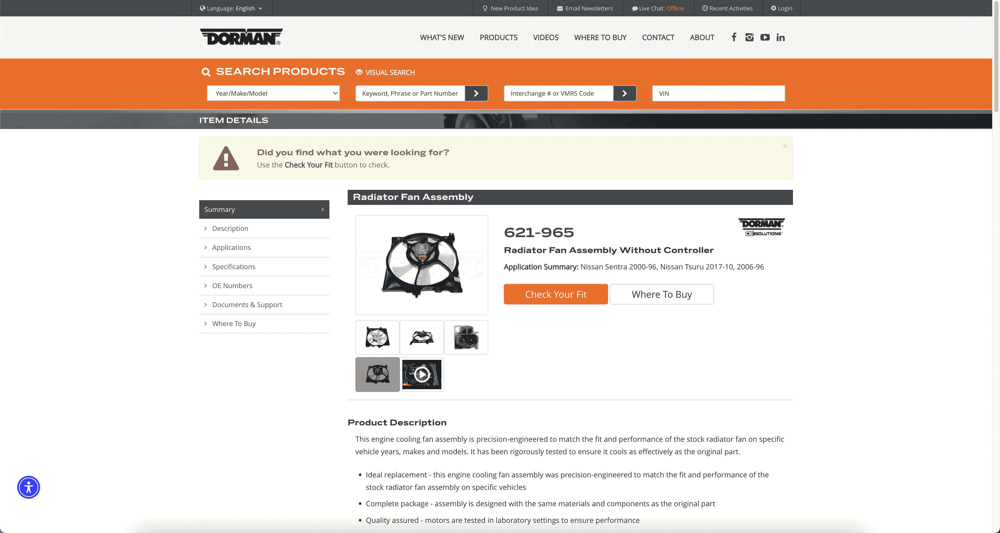
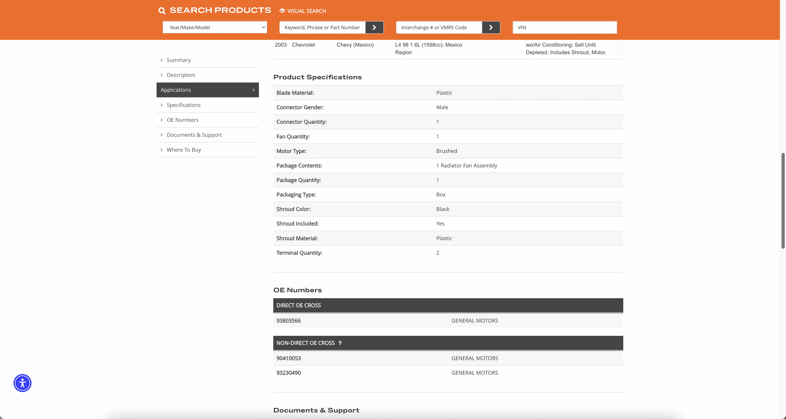
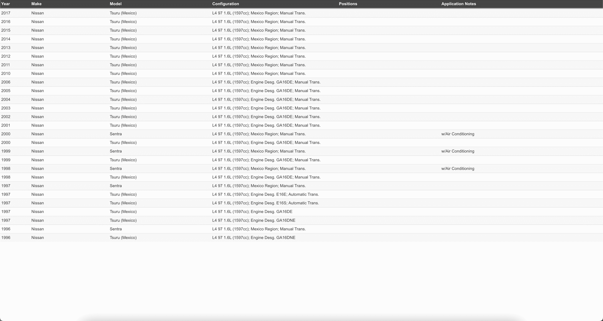
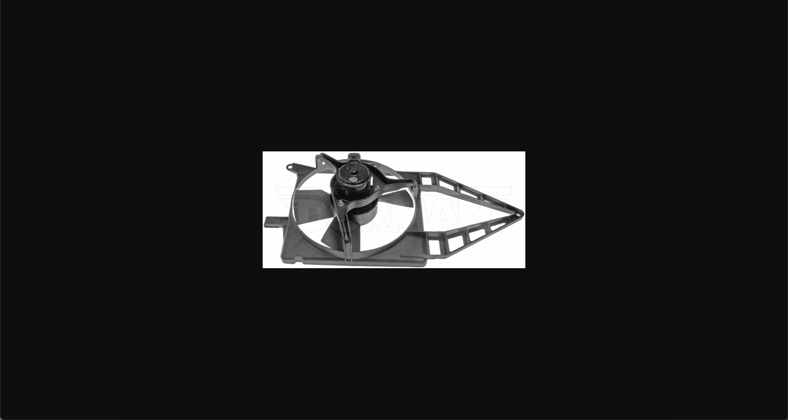

# TOC:

- [1. Page](#1-page)
- [2. Url](#2-url)
- [3. Part](#3-part)
- [4. Compatibility](#4-compatibility)
- [5. Picture](#5-picture)

- - -

## 1. Page

- Url: https://www.dormanproducts.com/gsearch.aspx?type=keyword&origin=keyword&parttype=Radiator%2520Fan%2520Assembly&start=0&num=100
- Picture: 
- Field:
  - **sku_count**: `750`
  - **page_count**: `8`
  - **page**: `1`
  - **page_url**: `'https://www.dormanproducts.com/gsearch.aspx?type=keyword&origin=keyword&parttype=Radiator%2520Fan%2520Assembly&start=0&num=100'`

## 2. Url

- Url: https://www.dormanproducts.com/gsearch.aspx?type=keyword&origin=keyword&parttype=Radiator%2520Fan%2520Assembly&start=0&num=100
- Picture: 
- Field:
  - **no**: `1`
  - **url**: `'https://www.dormanproducts.com/p-76729-621-916.aspx?parttype=Radiator%2520Fan%2520Assembly&origin=keyword'`

## 3. Part

- Url: https://www.dormanproducts.com/p-76729-621-916.aspx?parttype=Radiator%2520Fan%2520Assembly&origin=keyword
- Picture:  
- Field:
  - **type_**: `'Radiator Fan Assembly'`
  - **json_src**: `'{"0": "https://static.dormanproducts.com/images/product/medium/621-916-001.JPG", "1": "https://static.dormanproducts.com/images/product/medium/621-916-009.JPG"}'`
  - **brand**: `'Dorman - OE Solutions'`
  - **part_number**: `'621-916'`
  - **description**: `'Radiator Fan Assembly Without Controller'`
  - **application_summary**: `'Chevrolet Chevy 2012-96, Chevrolet Chevy Pickup 2003-99'`
  - **warning**: `''`
  - **compatibility_home**: `'https://www.dormanproducts.com/itemdetailapp.aspx?ProductID=76729&PartType=Radiator+Fan+Assembly&start=0&num=50'`
  - **json_specification**: `'{"Blade Material": "Plastic", "Connector Gender": "Male", "Connector Quantity": "1", "Fan Quantity": "1", "Motor Type": "Brushed", "Package Contents": "1 Radiator Fan Assembly", "Package Quantity": "1", "Packaging Type": "Box", "Shroud Color": "Black", "Shroud Included": "Yes", "Shroud Material": "Plastic", "Terminal Quantity": "2"}'`
  - **oem**: `'93803566;90410053;93230490'`

## 4. Compatibility

- Url: https://www.dormanproducts.com/itemdetailapp.aspx?ProductID=76729&PartType=Radiator+Fan+Assembly&start=0&num=50
- Picture: 
- Field:
  - **compatibility_page**: `1`
  - **compatibility_url**: `'https://www.dormanproducts.com/itemdetailapp.aspx?ProductID=76729&PartType=Radiator+Fan+Assembly&start=0&num=50'`
  - **compatibility_no**: `1`
  - **Year**: `'2012'`
  - **Make**: `'Chevrolet'`
  - **Model**: `'Chevy (Mexico)'`
  - **Configuration**: `'L4 98 1.6L (1598cc); Mexico Region'`
  - **Positions**: `''`
  - **Application Notes**: `'wo/Air Conditioning; Sell Until Depleted; Includes Shroud, Motor, and Blade'`

## 5. Picture

- Url: https://static.dormanproducts.com/images/product/medium/621-916-001.JPG
- Picture: 
