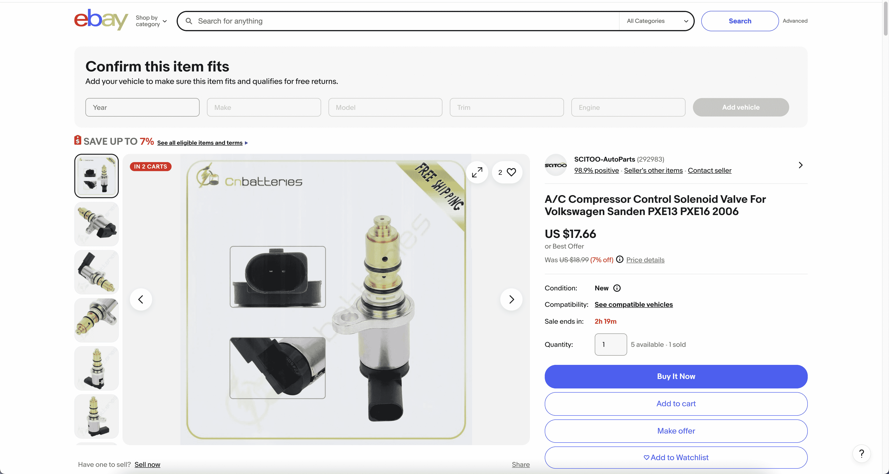
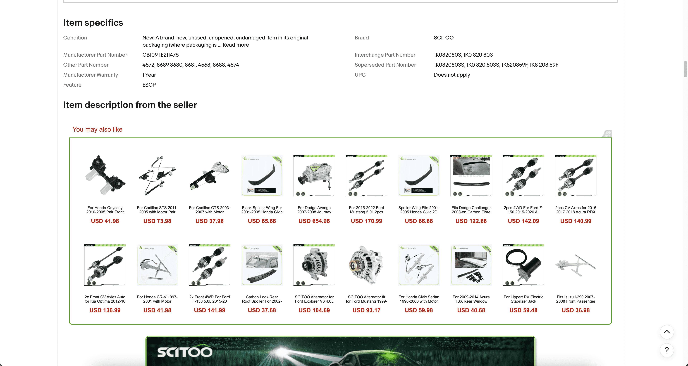
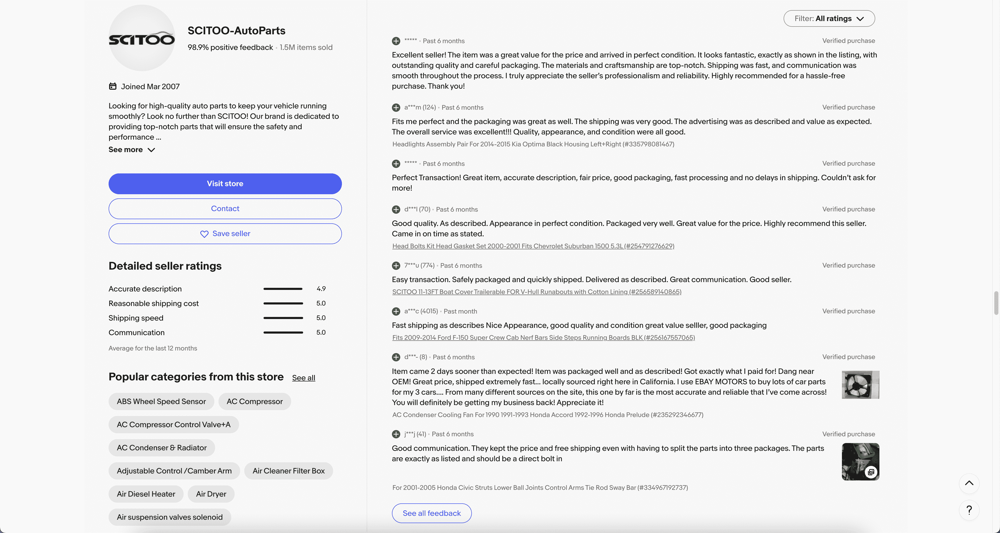
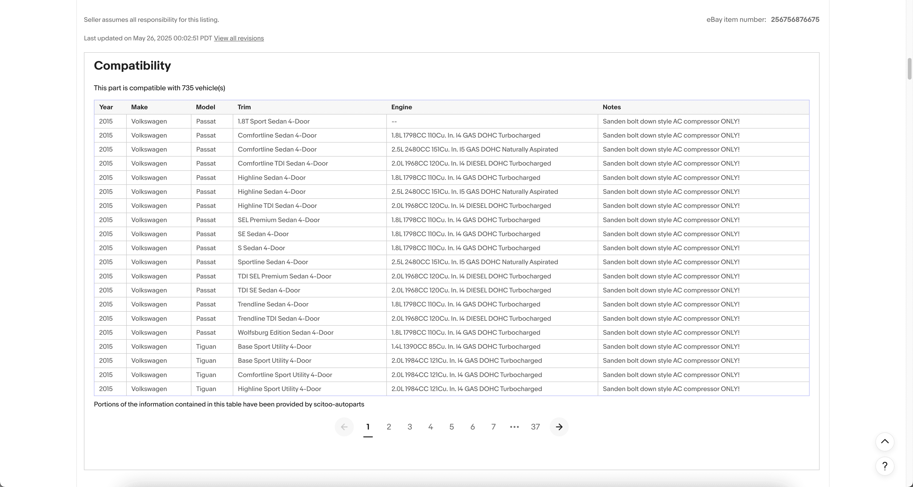

# TOC:

- [1. Url](#1-url)
- [2. Part](#2-part)
- [3. Compatibility](#3-compatibility)

- - -

## 1. Url

- Url: https://www.ebay.com/itm/256756876675?_ul=US&_stpos=91710&orig_cvip=true
- Picture: 
- Field:
  - **default_no**: `1`
  - **join_indn**: `'256756876675;1'`
  - **market**: `'EBAY-US'`
  - **country**: `'US'`
  - **language**: `'en'`
  - **locale**: `'en-US'`
  - **url**: `'https://www.ebay.com/itm/256756876675?_ul=US&_stpos=91710&orig_cvip=true'`

## 2. Part

- Url: https://www.ebay.com/itm/256756876675?_ul=US&_stpos=91710&orig_cvip=true
- Picture:   
- Field:
  - **json_delivery**: `'{"0": "Standard Shipping", "1": "Estimated between Thu, Jun 12 and Mon, Jun 16", "2": "Shipping: Free shipping"}'`
  - **json_location**: `'{"0": "Ontario, California, United States"}'`
  - **json_src**: `'{"0": "https://i.ebayimg.com/images/g/w~QAAOSw7tFnZQPw/s-l500.jpg", "1": "https://i.ebayimg.com/images/g/ahcAAOSw-WhnZQPw/s-l500.jpg", "2": "https://i.ebayimg.com/images/g/QyQAAOSwL3BnZQPw/s-l500.jpg", "3": "https://i.ebayimg.com/images/g/rwoAAOSw3kVnZQPx/s-l500.jpg", "4": "https://i.ebayimg.com/images/g/AJIAAOSwOstnZQQE/s-l500.jpg", "5": "https://i.ebayimg.com/images/g/f8EAAOSwr8lnZQQF/s-l500.jpg", "6": "https://i.ebayimg.com/images/g/zkgAAOSwgutnZQQF/s-l500.jpg", "7": "https://i.ebayimg.com/images/g/DOcAAOSw8NplLtwK/s-l500.jpg"}'`
  - **breadcrumbs**: `'5. A/C Compressors & Clutches (https://www.ebay.com/b/Car-Truck-A-C-Compressors-Clutches/33543/bn_561583)\n4. Air Conditioning & Heating (https://www.ebay.com/b/Car-Truck-Air-Conditioning-Heating/33542/bn_584326)\n3. Car & Truck Parts & Accessories (https://www.ebay.com/b/Car-Truck-Parts-Accessories/6030/bn_562630)\n2. Parts & Accessories (https://www.ebay.com/b/Auto-Parts-Accessories/6028/bn_569479)\n1. eBay Motors (https://www.ebay.com/b/Auto-Parts-and-Vehicles/6000/bn_1865334)'`
  - **json_seller_rating**: `'{"Accurate description": 4.9, "Reasonable shipping cost": 5, "Shipping speed": 5, "Communication": 5}'`
  - **json_specification**: `'{"Condition": "New: A brand-new, unused, unopened, undamaged item in its original packaging (where packaging is applicable). Packaging should be the same as what is found in a retail store, unless the item was packaged by the manufacturer in non-retail packaging, such as an unprinted box or plastic bag. See the seller\'s listing for full details.", "Brand": "SCITOO", "Manufacturer Part Number": "CB109TE21147S", "Interchange Part Number": "1K0820803, 1K0 820 803", "Other Part Number": "4572, 8689 8680, 8681, 4568, 8688, 4574", "Superseded Part Number": "1K0820803S, 1K0 820 803S, 1K820859F, 1K8 208 59F", "Manufacturer Warranty": "1 Year", "UPC": "Does not apply", "Feature": "ESCP"}'`
  - **description_url**: `'https://itm.ebaydesc.com/itmdesc/256756876675?t=1748242969000&category=33543&seller=scitoo-autoparts&excSoj=1&ver=0&excTrk=1&lsite=100&ittenable=true&domain=ebay.com&descgauge=1&cspheader=1&oneClk=2&secureDesc=1'`
  - **title**: `'A/C Compressor Control Solenoid Valve For Volkswagen Sanden PXE13 PXE16 2006'`
  - **subtitle**: `''`
  - **json_price**: `'{"style": 1, "now": "US $17.66", "origin": "$17.66 with coupon code"}'`
  - **json_quantity**: `'{"0": "5 available", "1": "1 sold"}'`
  - **store_name**: `'SCITOO-AutoParts'`
  - **store_url**: `'https://www.ebay.com/str/cnbatteries?_trksid=p4429486.m145687.l149267'`
  - **store_ssn**: `'SCITOO-AutoParts'`
  - **store_popular_category**: `'1. ABS Wheel Speed Sensor (https://www.ebay.com/str/cnbatteries/ABS-Wheel-Speed-Sensor/_i.html?store_cat=27808260016)\n2. AC Compressor (https://www.ebay.com/str/cnbatteries/AC-Compressor/_i.html?store_cat=16398759016)\n3. AC Compressor Control Valve+A (https://www.ebay.com/str/cnbatteries/AC-Compressor-Control-Valve-A/_i.html?store_cat=35372442016)\n4. AC Condenser & Radiator (https://www.ebay.com/str/cnbatteries/AC-Condenser-Radiator/_i.html?store_cat=25489422016)\n5. Adjustable Control /Camber Arm (https://www.ebay.com/str/cnbatteries/Adjustable-Control-Camber-Arm/_i.html?store_cat=41708444016)\n6. Air Cleaner Filter Box (https://www.ebay.com/str/cnbatteries/Air-Cleaner-Filter-Box/_i.html?store_cat=29351514016)\n7. Air Diesel Heater (https://www.ebay.com/str/cnbatteries/Air-Diesel-Heater/_i.html?store_cat=29256624016)\n8. Air Dryer (https://www.ebay.com/str/cnbatteries/Air-Dryer/_i.html?store_cat=37459800016)\n9. Air suspension valves solenoid (https://www.ebay.com/str/cnbatteries/Air-suspension-valves-solenoid/_i.html?store_cat=29869987016)'`

## 3. Compatibility

- Url: https://www.ebay.com/itm/256756876675?_ul=US&_stpos=91710&orig_cvip=true
- Picture: 
- Field:
  - **compatibility_page**: `1`
  - **compatibility_url**: `'https://www.dormanproducts.com/itemdetailapp.aspx?ProductID=76729&PartType=Radiator+Fan+Assembly&start=0&num=50'`
  - **compatibility_no**: `1`
  - **Year**: `'2015'`
  - **Make**: `'Volkswagen'`
  - **Model**: `'Passat'`
  - **Trim**: `'1.8T Sport Sedan 4-Door'`
  - **Engine**: `'--'`
  - **Notes**: `'Sanden bolt down style AC compressor ONLY!'`
