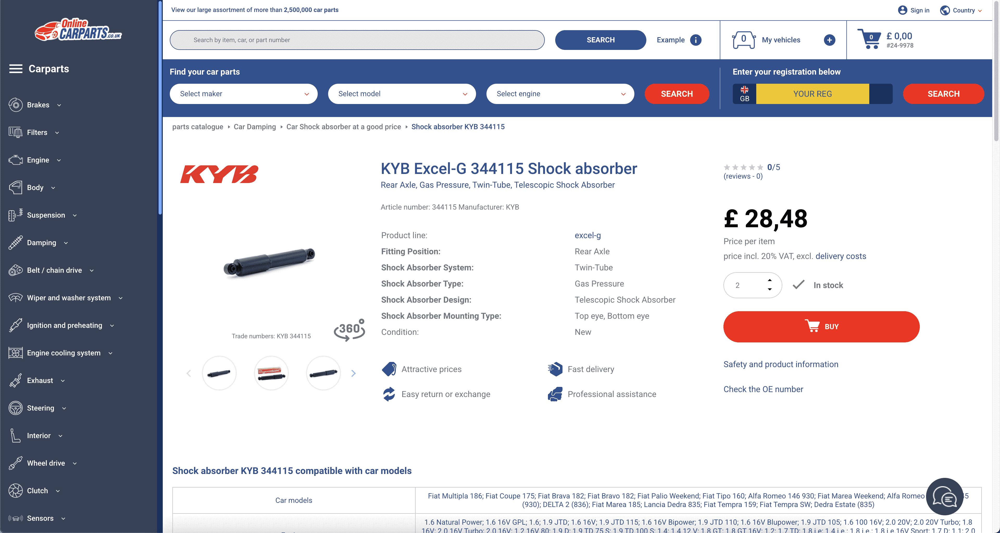

# TOC:

- [1. Url](#1-url)
- [2. Part](#2-part)
- [3. Model](#3-model)
- [4. Compatibility](#4-compatibility)
- [5. Picture](#5-picture)

- - -

## 1. Url

- Url: https://www.onlinecarparts.co.uk/ajax/search/autocomplete?keyword=344115
- Picture: 
- Field:
  - **part_no**: `1`
  - **tag**: `'KYB Shock absorber (344115)'`
  - **url**: `'https://www.onlinecarparts.co.uk/kyb-828666.html'`
  - **article_id**: `828666`
  - **article_no**: `'344115'`

## 2. Part

- Url: https://www.onlinecarparts.co.uk/kyb-828666.html
- Picture:  
- Field:
  - **json_src**: `'{"0": "https://media.autoteiledirekt.de/360_photos/828666/preview.jpg", "1": "https://cdn.autoteiledirekt.de/thumb?id=828666&m=0&n=0&lng=en&rev=94077896", "2": "https://cdn.autoteiledirekt.de/thumb?id=828666&m=0&n=1&lng=en&rev=94077896", "3": "https://cdn.autoteiledirekt.de/thumb?id=828666&m=0&n=2&lng=en&rev=94077896", "4": "https://cdn.autoteiledirekt.de/thumb?id=828666&m=0&n=3&lng=en&rev=94077896", "5": "https://cdn.autoteiledirekt.de/thumb?id=828666&m=0&n=4&lng=en&rev=94077896", "6": "https://cdn.autoteiledirekt.de/thumb?id=828666&m=0&n=5&lng=en&rev=94077896"}'`
  - **type_**: `'Shock absorber'`
  - **price**: `'GBP 28.48'`
  - **breadcrumbs**: `'3. Car Shock absorber at a good price (https://www.onlinecarparts.co.uk/spare-parts/shock-absorber.html)\n2. Car Damping (https://www.onlinecarparts.co.uk/spare-parts/damping-group.html)\n1. parts catalogue (https://www.onlinecarparts.co.uk/spare-parts.html)'`
  - **title**: `'KYB Excel-G 344115 Shock absorber'`
  - **subtitle**: `'Rear Axle, Gas Pressure, Twin-Tube, Telescopic Shock Absorber'`
  - **json_info**: `'{"Article number": "344115", "Manufacturer": "KYB"}'`
  - **json_detail**: `'{"Product line": "nan", "Fitting Position": "Rear Axle", "Shock Absorber System": "Twin-Tube", "Shock Absorber Type": "Gas Pressure", "Shock Absorber Design": "Telescopic Shock Absorber", "Shock Absorber Mounting Type": "Top eye, Bottom eye", "Condition": "New"}'`
  - **oem**: `'46402631;46405783;46409717;46414480;46414586;46415599;46416471;46417133;46417134;46421626;46424224;46437778;46439462;46442796;46444663;46455144;46456096;46456415;46459363;46463792;46463793;46463794;46463795;46463796;46468146;46477065;46510793;46518129;46519351;46528791;46539299;46747928;46798864;46803344;46839039;51846396;60500393;60602722;60605178;60607640;60620082;60620083;71712474;71712478;71712481;71712486;71712487;71712488;71712641;71713814;71716544;71716546;71718285;71718287;7610120;7610121;7613698;7619437;7638163;7640930;7640931;7642982;7642983;7648480;7648482;7658106;7658317;7678636;7690033;7720720;7753565;7754144;7777585;7777948;7782234;7783497;7788046;82491295;KK13528700A;KK15328700B'`
  - **json_equivalent**: `'{"BILSTEIN": "19-019826", "BOGE": "27-D92-A", "MONROE": "23430", "SACHS": "170392"}'`

## 3. Model

- Url: https://www.onlinecarparts.co.uk/ajax/product/related-auto?productId=828666&makerId=2
- Picture: 
- Field:
  - **make_no**: `1`
  - **make_id**: `'2'`
  - **make**: `'ALFA ROMEO'`
  - **model_url**: `'https://www.onlinecarparts.co.uk/ajax/product/related-auto?productId=828666&makerId=2'`
  - **model_no**: `1`
  - **model_id**: `'278'`
  - **model**: `'ALFA ROMEO 145 (930) (Year of Construction 07.1994 - 01.2001)'`
  - **compatibility_url**: `'https://www.onlinecarparts.co.uk/ajax/product/related/vehicles?articleId=828666&makerId=2&modelId=278'`

## 4. Compatibility

- Url: https://www.onlinecarparts.co.uk/ajax/product/related/vehicles?articleId=828666&makerId=2&modelId=278
- Picture: 
- Field:
  - **compatibility_no**: `1`
  - **compatibility**: `'1.4 i.e. (930.A3), Year of Construction 07.1994 - 12.1996, 1351 ccm, 90 hp'`

## 5. Picture

- Url: https://media.autoteiledirekt.de/360_photos/828666/preview.jpg
- Picture: 
