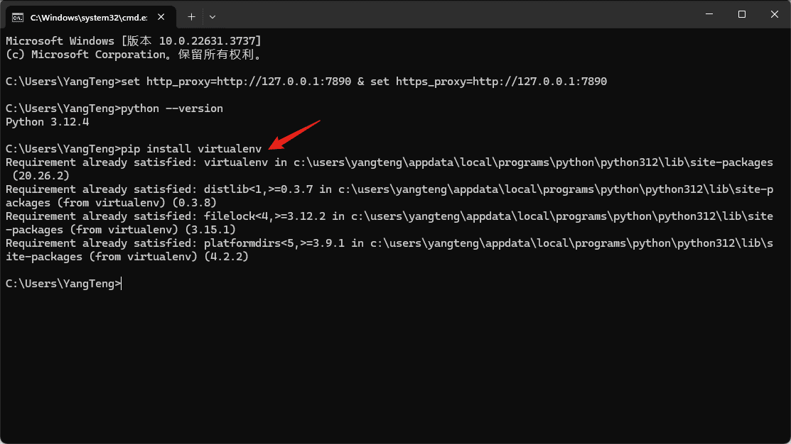
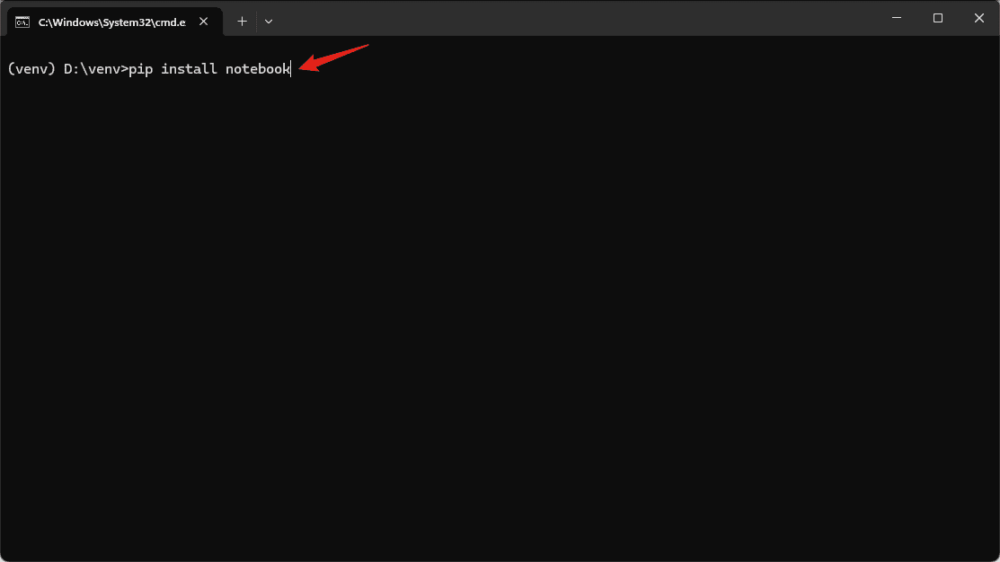
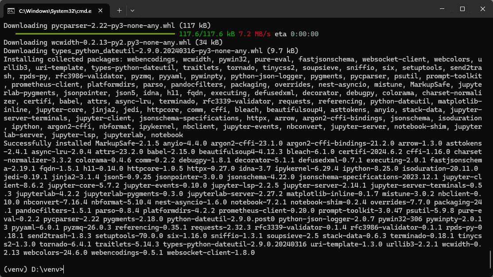

## 目录

- [1. 《采购中心爬虫需求处理流程规范》](#1-采购中心爬虫需求处理流程规范)
- [2. 《Python环境搭建》](#2-python环境搭建)
- [3. 《爬虫临时指北》](#3-爬虫临时指北)

- - -

- - -

## 1. 《采购中心爬虫需求处理流程规范》

- |文件版本|修订日期|修订人|审核人|批准人|修订说明|
  |:-:|:-:|:-:|:-:|:-:|:-:|
  |V1.0|2024/09/04|Lennon|Miang|Joel|初版|
  |||||||

### 目录

- [一、需求整理与提交](#一需求整理与提交)
- [二、邮件与附件格式](#二邮件与附件格式)
- [三、需求处理](#三需求处理)
- [四、其他事项](#四其他事项)

 

- 为提高爬虫需求处理的效率，确保信息传达的准确性和工作流程的规范化，现制定如下流程规范。请采购中心各事业部参照执行，并给予配合。

### 一、需求整理与提交

#### 1. 对接负责人自行处理：

- 对于 RockAuto、Dorman、eBay、Cardone、Standard、SpectraPremium、FourSeasons等网站的爬虫需求，因其操作简单且已提供完整代码，原则上由各事业部的对接负责人自行进行爬取。

- 如果在操作中遇到问题，可联系Lennon进行技术支持。

#### 2. 邮件提交需求：

- 对于其他较为复杂的网站爬虫需求，请对接负责人整理需求，以Excel文件形式作为附件发送Lennon，并抄送本部门部长和Joel。

### 二、邮件与附件格式

#### 1. 邮件主题：

- 请注明“【爬虫需求】+部门名称+简要内容”。 例如：“【爬虫需求】项目投放部 - Steering Damper”。

#### 2. 邮件正文：

- 需求描述：简要描述爬虫需求的目标数据。

- 时间要求：请明确需求的时间要求或对紧急程度做出说明。

- 其他说明：包括文件输出样式等特殊要求，都请在邮件正文详述。

#### 3. Excel附件格式要求：

- Excel文件应包含简洁但清晰的爬虫需求信息，第一列为需求序号，第二列为具体的目标网址。 

- 请确保每个需求都有明确的网址，避免“爬一下Dorman 家的卡扣”这种含糊不清的描述。

### 三、需求处理

#### 1. 需求处理流程：

- Lennon在收到需求后会进行初步评估，如有疑问会与对接负责人进一步沟通。

- 需求确认后，数据部将安排具体的任务，并尽量在规定的时间内完成。

- 爬虫任务完成后，数据部会通过邮件反馈获取到的数据。

#### 2. 查重处理：

- 如无特殊要求，请各事业部对接负责人自行完成查重工作。

- 如果有特殊的查重需求，请在邮件正文中进行详细说明，并将邮件抄送 Nolan。

### 四、其他事项

- 请对接负责人在提交需求时，尽量确保信息准确，避免因描述不清导致的延误。

- 数据部会对每项爬虫需求进行记录，并定期向采购中心领导汇报进展情况。

- 如有紧急需求或特别事项，请提前告知Lennon，以便及时协调处理。

- - -

- - -

## 2. 《Python环境搭建》

- |文件版本|修订日期|修订人|审核人|批准人|修订说明|
  |:-:|:-:|:-:|:-:|:-:|:-:|
  |V1.0|2024/06/19|Lennon|Miang|Joel|初版|
  |||||||

### 目录

- [一、Python下载和安装](#一python下载和安装)
- [二、虚拟环境](#二虚拟环境)
- [三、Jupyter Notebook](#三jupyter-notebook)
- [四、每次使用](#四每次使用)

### 一、Python下载和安装

1. 打开Python的官方网址[Welcome to Python.org](https://www.python.org/) 

2. 根据实际需要下载相应的“安装程序”（一般选择Windows installer (64-bit)） 

3. 运行下载好的“安装程序”，确认选中下方的复选框，然后点击“Install Now” 

4. 点击“Disable path length limit”取消路径长度限制 

5. 快捷键“WIN+R”打开系统的“运行”窗口，输入“cmd”打开“命令提示符”窗口 

6. 输入“python --version”查看是否安装成功 

### 二、虚拟环境

1. 输入“pip install virtualenv”下载安装“虚拟环境包” 

2. 选定一个路径，然后打开“命令提示符”窗口 

3. 输入“virtualenv venv”创建一个名为“venv”的虚拟环境  

4. 进入虚拟环境的路径，然后打开“命令提示符”窗口 

5. 输入“.\Scripts\activate.bat”激活虚拟环境 

6. 命令提示符”窗口增加了“venv”前缀，表示当前处于名为“venv”的Python环境，即虚拟环境激活成功 

### 三、Jupyter Notebook

- 在虚拟环境中输入“pip install notebook”下载安装“Jupyter Notebook包”  

### 四、每次使用

1. 激活虚拟环境  

2. 输入“jupyter notebook”打开Jupyter Notebook   

- - -

- - -

## 3. 《爬虫临时指北》

### 目录

- [一、常爬网站](#一常爬网站)
- [二、理论基础](#二理论基础)
- [三、实际使用](#三实际使用)
- [附录A Collaborators](#附录a-collaborators)
- [附录B 费用报销](#附录b-费用报销)

### 一、常爬网站
- |序号|网址及示例|
  |:-:|:-|
  |1|[RockAuto](https://www.rockauto.com/en/parts/melling,timing+chain+&+component+kit,5756)|
  |2|[Dorman](https://www.dormanproducts.com/gsearch.aspx?type=keyword&origin=keyword&q=wheel%2520cylinder)|
  |3|[eBay](https://www.ebay.com/sch/i.html?_dkr=1&iconV2Request=true&_blrs=recall_filtering&_ssn=scitoo-autoparts&store_cat=0&store_name=cnbatteries&_oac=1&_nkw=ac%20compressor)|
  |4|[Cardone](https://www.cardone.com/motors/wiper-and-washer/windshield-wiper-motor/?sort=alphaasc)|
  |5|[Standard](https://www.standardbrand.com/en/ecatalog?part=Clutch%20Starter%20Safety%20Switch&type=p)|
  |7|[SpectraPremium](https://ecat.spectrapremium.com/en/parts?line=oil_pans&universal=0&hide-exclusives-canadian-market=0)|
  |9|[FourSeasons](https://www.4s.com/en/ecatalog?part=Evaporator%20Core&type=p&search=s)|
  |10|[Amazon](https://www.amazon.com/gp/bestsellers/automotive/15730511/ref=pd_zg_hrsr_automotive)|
  |12|[1AAuto](https://www.1aauto.com/catalog/brands)|
  |18|[Auveco](https://www.auveco.com/products/assortments/cabinetandcompartmentbinassortments)|
  |24|[Gates](https://www.gates.com/us/en/search.html?searchType=product&text=Positive+Crankcase+Ventilation+%28PCV%29+Hose)|
  |26|[Moog](https://www.moogparts.com/find-my-part.html)|
  |36|[UAC](https://uacparts.com/)|

### 二、理论基础

#### 1. Python

- [Python教程_1【网站：菜鸟教程】](https://www.runoob.com/python3/python3-tutorial.html)、[Python教程_2【网站：廖雪峰】](https://liaoxuefeng.com/books/python/introduction/index.html)

- [解决路径长度限制导致的Error](https://blog.csdn.net/weixin_43658159/article/details/127454046)

##### 1.1. Pip换源

- 临时换源：`-i`参数
  > 清华：`pip install `<ins>`package`</ins>` -i https://pypi.tuna.tsinghua.edu.cn/simple`  
  > 阿里云：`pip install `<ins>`package`</ins>` -i http://mirrors.aliyun.com/pypi/simple`  
  > 中科大：`pip install `<ins>`package`</ins>` -i http://pypi.mirrors.ustc.edu.cn/simple`  
  > 华为：`pip install `<ins>`package`</ins>` -i https://repo.huaweicloud.com/repository/pypi/simple`  
  > 腾讯：`pip install `<ins>`package`</ins>` -i http://mirrors.cloud.tencent.com/pypi/simple`

- 永久换源：自行百度

##### 1.2. 虚拟环境

- [virtualenv教程【网站：廖雪峰】](https://liaoxuefeng.com/books/python/built-in-modules/venv/index.html)

##### 1.3. Library包

- 查看可安装版本：`pip index versions `<ins>`package`</ins>

- 安装指定版本：`pip install `<ins>`package==x.xx.xxx`</ins>

- |序号|名称|安装命令|参考|
  |:-:|:-|:-|:-:|
  |1|virtualenv|`pip install virtualenv`|[官网](https://virtualenv.pypa.io/en/latest/installation.html)|
  |2|jupyter notebook|`pip install notebook`|[官网](https://jupyter.org/install#jupyter-notebook)|
  |3|jupyterlab-language-pack-zh-CN|`pip install jupyterlab-language-pack-zh-CN`|[Python Package Index (PyPI)](https://pypi.org/project/jupyterlab-language-pack-zh-CN/)|
  |4|pandas|`pip install pandas`|[官网](https://pandas.pydata.org/docs/getting_started/index.html#getting-started)|
  |5|openpyxl|`pip install openpyxl`|[官网](https://openpyxl.readthedocs.io/en/stable/tutorial.html)|
  |6|BeautifulSoup|`pip install bs4`|[官网](https://www.crummy.com/software/BeautifulSoup/bs4/doc/index.html#installing-beautiful-soup)|
  |7|lxml|`pip install lxml`|[官网](https://lxml.de/installation.html)|
  |8|gevent|`pip install gevent`|[官网](https://www.gevent.org/install.html)|
  |9|selenium|`pip install selenium`|[官网](https://www.selenium.dev/documentation/webdriver/getting_started/install_library/) [ChromeDriver](https://developer.chrome.com/docs/chromedriver) -> [Dashboard](https://googlechromelabs.github.io/chrome-for-testing/)|
  |10|pillow|`pip install pillow`|[官网](hhttps://pillow.readthedocs.io/en/latest/installation/basic-installation.html)|
  |11|tqdm|`pip install tqdm`|[Python Package Index (PyPI)](https://pypi.org/project/tqdm/)|

- 升级：`pip install `<ins>`package`</ins>` --upgrade`

#### 2. HTML & XPath

- [HTML (Hyper Text Markup Language) 教程【网站：菜鸟教程】](https://www.runoob.com/html/html-tutorial.html)

- [XPath (XML Path Language) 教程【网站：菜鸟教程】](https://www.runoob.com/xpath/xpath-tutorial.html)

#### 3. JavaScript & Tampermonkey

- [JavaScript教程1【网站：菜鸟教程】](https://www.runoob.com/js/js-tutorial.html)、[JavaScript教程2【网站：廖雪峰】](https://liaoxuefeng.com/books/javascript/introduction/index.html)

- [Tampermonkey官网](https://www.tampermonkey.net/)

- [Tampermonkey教程1【网站：bilibili】](https://www.bilibili.com/video/BV1yT411L7n7/)、[Tampermonkey教程1【网站：bilibili】](https://www.bilibili.com/video/BV1Da411Z7s7/)

#### 4. 爬虫

- [requests教程【网站：廖雪峰】](https://liaoxuefeng.com/books/python/third-party-modules/requests/index.html)

- [selenium常用参数【网站：CSDN】](https://blog.csdn.net/m0_56676945/article/details/129215165)、[selenium参数列表【网站：Peter】](https://peter.sh/experiments/chromium-command-line-switches/)

- [爬虫教程【网站：bilibili】](https://www.bilibili.com/video/BV1bL4y1V7q1/)

- [《Python 3网络爬虫开发实战（第2版）》](https://www.ituring.com.cn/book/2847)

### 三、实际使用

#### 1. Postman

- [Postman官网](https://www.postman.com/downloads/)

- [Postman教程【网站：bilibili】](https://www.bilibili.com/video/BV1hP4y177gS/)

#### 2. JSON

- [JSON (JavaScript Object Notation) 在线解析](https://www.json.cn/)

#### 3. 正则表达式

- [RegEx (Regular Expression) 教程【网站：GitHub】](https://github.com/ziishaned/learn-regex)

- [RegEx在线测试](https://www.whatsmyip.org/regular-expression-tester/)

#### 4. 反反爬

- [反反爬教程【网站：bilibili】](https://www.bilibili.com/video/BV1cy4y1V771/)

- [User-Agent的讲解【网站：少数派】](https://sspai.com/post/75349)

- [IP代理【网站：快代理】](https://www.kuaidaili.com/) -> 产品 -> 隧道代理

- [验证码识别【网站：超级鹰】](https://www.chaojiying.com/)

#### 5. 爬虫速度提升

- [提速教程_1【网站：CSDN】](https://blog.csdn.net/weixin_51656605/article/details/113694044)、[提速教程_2【网站：bilibili】](https://www.bilibili.com/video/BV1bK411A7tV/?p=2)

- [gevent教程_1【网站：CSDN】](https://blog.csdn.net/qq_45476428/article/details/108782593)、[gevent教程_2【网站：CSDN】](https://blog.csdn.net/freeking101/article/details/53097420)

#### 6. Git

- [Git教程_1【网站：菜鸟教程】](https://www.runoob.com/git/git-tutorial.html)、[Git教程_2【网站：廖雪峰】](https://liaoxuefeng.com/books/git/introduction/index.html)

### 附录A Collaborators

- |GitHub|Name|E-mail|
  |:-:|:-:|:-:|
  |2024Hope2002|Hoppe|2721751152@qq.com|
  |Aleya-L|Aleya|lhxin1228@163.com|
  |Archer9528|Archer|893393406@qq.com|
  |bibabo119|Camilla|2676128666@qq.com|
  |Carver-HJQ|Carver|hejiaqi0318@163.com|
  |coarl-cc|Luka|864383059@qq.com|
  |Crissy1010|Crissy|2523031949@qq.com|
  |DamnPapacito|Nolan|414180483@qq.com|
  |hlxjustin|Liz|hlx_justin@163.com|
  |Isiah-yi|Isiah|pd56@cht-group.net|
  |Jay85208520|Jay|2674475531@qq.com|
  |Larkin420420|Larkin|heijiaow@163.com|
  |Marceline-day|Marceline|mktg480@cht-group.net|
  |Melanie-77|Melanie|1103533236@qq.com|
  |Oolong-bit|Ward|1106622586@qq.com|
  |Paulcccc|Paul|573638095@qq.com|
  |shinian9911|Bear|2863415146@qq.com|
  |Westbroobo|Westbroobo|lswbk888@gmail.com|
  |Ybai7819|Yiheng|mktg483@cht-group.net|
  |YL-Wang1|Grant|281689104@qq.com|
  |yuanlinabc|Leif|zyl964051609@gmail.com|

### 附录B 费用报销

- |发票类型|发票抬头|纳税人识别号|
  |:-:|:-:|:-:|
  |企业增值税普通发票/电子普通发票|福建扬腾创新信息科技有限公司|91350100MA338EEKXY|

# 待更新

- |网址|爬前操作|目录字段|内容字段|
  |:-|:-|:-|:-|
  |06. [Summit](https://www.summitracing.com/search?PageSize=100&SortBy=SKU&SortOrder=Ascending&keyword=LS%20Oil%20Pan)  &emsp;-|1. `Records Per Page` -> `100 Records Per Page` 2. `Sort By` -> `Part Number (a-z)`|$\color{red}{1. Menu}$【Tampermonkey】 $\color{blue}{输出：}$`Page`、`No.`、`Url`|$\color{red}{2. Part}$【requests】 $\color{blue}{输入：}$<ins>`No.`</ins>[Menu]、<ins>`Url`</ins>[Menu] $\color{blue}{输出：}$<ins>`序号`</ins>、`Part_Number`、`Title`、`Description`、`Pic`(n)、<ins>`Url`</ins>、`Src`、`其他Overview`|
  |08. [Denniskirk](https://www.denniskirk.com/atv/cv-axle/brandasc.srt/100.ipp)  &emsp;Westbroobo|1. `Results per Page` -> `100` 2. `Sort by` -> `Brand: A-Z`|$\color{red}{1. Menu}$【Tampermonkey】 $\color{blue}{输出：}$`Page`、`No.`、`Url`|$\color{red}{2. Part}$【Tampermonkey】 $\color{blue}{输入：}$<ins>`No.`</ins>[Menu]、<ins>`Url`</ins>[Menu] $\color{blue}{输出：}$<ins>`序号`</ins>、`Brand`、`Title`、`Vehicle`、`OE`、`Pic`(n)、<ins>`Url`</ins>、`Src`、`其他Specifications`|
  |11. [AutoteileDirekt](https://www.autoteiledirekt.de/suche.html?keyword=Radlagersatz%20SKF&brand%5B0%5D=50)  &emsp;Aleya||$\color{red}{1. Menu}$【Tampermonkey】 $\color{blue}{输出：}$`Page`、`No.`、`Url`(y)|$\color{red}{2. Part}$【Console】 $\color{blue}{输入：}$<ins>`No.`</ins>[Menu]、`Url`[Menu] $\color{blue}{输出：}$<ins>`序号`</ins>、`Title`、`Subtitle`、`Artkl`、`Product_Id`、`Price`、`Vehicle_1`(n)、`Vehicle_2`(n)、`OE`、`Kit`、`Pic`(n)、`Url`(n)、`Src`、`Maker_Id`、`其他Desc`、`其他TecDoc`  $\color{red}{3. Model}$【Console】 $\color{blue}{输入：}$<ins>`Product_Id`</ins>[Part]、<ins>`Maker_Id`</ins>[Part] $\color{blue}{输出\_1：}$`No.`、<ins>`Product_Id`</ins>、<ins>`Maker_Id`</ins>、`Model_Id`、`Vehicle_1` $\color{blue}{输出：}$<ins>`Product_Id`</ins>、`Vehicle_1`(y)  $\color{red}{4. Engine}$【Console】 $\color{blue}{输入：}$<ins>`Product_Id`</ins>[Model_1]、`Maker_Id`[Model_1]、`Model_Id`[Model_1]、`Vehicle_1`[Model_1] $\color{blue}{输出：}$<ins>`Product_Id`</ins>、`Vehicle_2`(y)  $\color{red}{5. Pic}$【Tampermonkey】 $\color{blue}{输入：}$`Src`[Part] $\color{blue}{输出：}$`Pic`(y)|
  |13. [Rotomaster](https://rotomaster.com/search.php?search_query=Turbocharger&section=product&_bc_fsnf=1&Part%20Type=Turbocharger&limit=30&sort=alphaasc)  &emsp;Westbroobo|1. `VIEW AS` -> `3` 2. `SHOW` -> `30 items per page` 3. `SORT BY` -> `A to Z`|$\color{red}{1. Menu}$【Tampermonkey】 $\color{blue}{输出：}$`Page`、`No.`、`Url`|$\color{red}{2. Part}$【requests】 $\color{blue}{输入：}$<ins>`No.`</ins>[Menu]、<ins>`Url`</ins>[Menu] $\color{blue}{输出：}$<ins>`序号`</ins>、`Title`、`Pic`(n)、<ins>`Url`</ins>、`Src`、`其他Attribute`、`其他Specifications`|
  |14. [TurbochargerPros](https://www.turbochargerpros.com/search_result.asp?w=garrett#/filter:brand:Garrett)  &emsp;-||$\color{red}{1. Menu}$【Tampermonkey】 $\color{blue}{输出：}$`Page`、`No.`、`Url`|$\color{red}{2. Part}$【requests】 $\color{blue}{输入：}$<ins>`No.`</ins>[Menu]、<ins>`Url`</ins>[Menu] $\color{blue}{输出：}$<ins>`序号`</ins>、`Title`、`Vehicle`、`Pic`(n)、<ins>`Url`</ins>、`Src`、`其他Specifications`|
  |15. [ATPAutoteile](https://www.atp-autoteile.de/de/search/n-243/o-1/b-1-592/bremsbelaege-bestprice-atec)  &emsp;Westbroobo|`Sortieren nach` -> `Preis absteigend`  1. 在详情页找出[`Make api`](https://www.atp-autoteile.de/de/product/vehicles/988398)：`https://www.atp-autoteile.de/de/product/vehicles/` + `Product_Id` 2. 在详情页找出[`Model api`](https://www.atp-autoteile.de/de/product/vehicles/988398/9953)：`https://www.atp-autoteile.de/de/product/vehicles/` + `Product_Id` + `/` + `Make_Code`|$\color{red}{1. Menu}$【Tampermonkey】 $\color{blue}{输出：}$`Page`、`No.`、`Url`、`Kit`|$\color{red}{2. Part}$【requests】 $\color{blue}{输入：}$<ins>`No.`</ins>[Menu]、<ins>`Kit`</ins>[Menu]、<ins>`Url`</ins>[Menu] $\color{blue}{输出：}$<ins>`序号`</ins>、`Sku`、`Brand`、`Manufacturer`、`Mpn`、`Product_Id`、`Title`、`Price`、<ins>`Kit`</ins>、`Vehicle_1`(n)、`Vehicle_2`(n)、`OE`、`Pic`(n)、<ins>`Url`</ins>、`Src`  $\color{red}{3. Make}$【requests】 $\color{blue}{输入：}$<ins>`序号`</ins>[Part]、<ins>`Product_Id`</ins>[Part] $\color{blue}{输出：}$<ins>`No.`</ins>、<ins>`Product_Id`</ins>、`Make`、`Make_Code`  $\color{red}{4. Model}$【requests】 $\color{blue}{输入：}$<ins>`No.`</ins>[Make]、<ins>`Product_Id`</ins>[Make]、`Make`[Make]、`Make_Code`[Make] $\color{blue}{输出：}$<ins>`No.`</ins>、<ins>`Product_Id`</ins>、`Vehicle_1`(y)、`Vehicle_2`(y)|
  |16. [Mevotech](https://www.mevotech.com/part/CMK100003)  &emsp;-|从`RockAuto`爬下来`Part_Number`，再去`Mevotech`官网获取`Vehicle`||$\color{red}{1. Vehicle}$【requests】 $\color{blue}{输入：}$<ins>`Part_Number`</ins>[RockAuto] $\color{blue}{输出：}$<ins>`Part_Number`</ins>、`Vehicle`(y)|
  |17. [Cub](https://www.cubelec.com.tw/switch-parts-en.php?ID=2)  &emsp;-|账号：CUBTPMS 密码：CUBTPMS|$\color{red}{1. Menu}$【Tampermonkey】 $\color{blue}{输出：}$`Page`、`No.`、`Src`、`Url`、`Part_Number`、`Name`、`OE`、`Vehicle`、`Date`、`Pic`(n)||
  |19. [MotoRAD](https://motorad.com/products/?categories=thermostat%2Ccoolant-housing&subcategories=thermostat-assembly-failsafe%2Cthermostat-assembly%2Cpower-sport-thermostat%2Cfail-safe-thermostat-w-housing%2Cstandard-failsafe%2Cegr-thermostat%2Chd-thermostat-w-housing%2Cstandard-naked-thermostat%2Chd-thermostat%2Cultrastat%2Cthermostat-kit-failsafe%2Cthermostat-w-housing%2Cthermostat%2Cthermostat-kit%2Cwater-pump-thermostat-assembly%2Chigh-flow-thermostat%2Cthermostat-kit-ultrastat%2Ceconomy-thermostat%2Cwater-outlet-coolant-housing)  &emsp;-||`Page`、***`Part_Number`***|1. `$_序号`、***`Part_Number`***、`Category`、`Type`、`Description`、`$_Vehicle`、`OE`、`$_Pic`、***`Url`***、`Src`、`其他Attribute`、`其他Specifications` 2. ***`Part_Number`***、`Vehicle`|
  |20. [SpectrePerformance](https://www.spectreperformance.com/cross-reference/stp)  &emsp;-||$\color{red}{1. Menu\underline{ }1}$【Tampermonkey】 $\color{blue}{输出：}$`No.`、`Name`、`Url_1`  $\color{red}{2. Menu}$【requests】 $\color{blue}{输入：}$<ins>`No.`</ins>[Menu_1]、<ins>`Name`</ins>[Menu_1]、`Url_1`[Menu_1] $\color{blue}{输出：}$<ins>`No.`</ins>、<ins>`Name`</ins>、`Url`|$\color{red}{3. Part}$【requests】 $\color{blue}{输入：}$<ins>`No.`</ins>[Menu]、<ins>`Url`</ins>[Menu] $\color{blue}{输出：}$<ins>`序号`</ins>、`Name`、`Title`、`Sku`、`Detail`、`Vehicle`(n)、`Pic`(n)、<ins>`Url`</ins>、`Src`、`分列OE`、`其他Specifications`  $\color{red}{4. Vehicle}$【requests】 $\color{blue}{输入：}$<ins>`Sku`</ins>[Part] $\color{blue}{输出：}$<ins>`Sku`</ins>、`Vehicle`(y)|
  |21. [CentricParts](https://www.centricparts.com/partFinder/page/index/?p=1&product_list_limit=25&product_list_order=part_number)  &emsp;-|1. `Sort By` -> `Part Number` 2. `Show` -> `25 per page`|$\color{red}{1. Menu\underline{ }1}$ $\color{blue}{输入：}$`Param_Total`[参数] $\color{blue}{输出：}$`Page`、`Url_1`  $\color{red}{2. Menu}$【requests】 $\color{blue}{输入：}$<ins>`Page`</ins>[Menu_1]、`Url_1`[Menu_1] $\color{blue}{输出：}$<ins>`Page`</ins>、`No.`、`Sku`、`Url`、`Src`|$\color{red}{3. Part}$【requests】 $\color{blue}{输入：}$<ins>`No.`</ins>[Menu]、<ins>`Sku`</ins>[Menu]、<ins>`Url`</ins>[Menu]、<ins>`Src`</ins>[Menu] $\color{blue}{输出：}$<ins>`序号`</ins>、<ins>`Sku`</ins>、`Status`、`Title`、`Summary`、`Vehicle`、`Pic`(n)、<ins>`Url`</ins>、<ins>`Src`</ins>、`其他Attribute`、`其他Details`|
  |22. [KaKaPart](http://www.kakapart.com/)  &emsp;-|从`CentricParts`爬下来`Sku`，再去`KaKaPart`官网获取`分列OE`||$\color{red}{1. OE}$【requests】 $\color{blue}{输入：}$<ins>`Sku`</ins>[CentricParts] $\color{blue}{输出：}$<ins>`Sku`</ins>、`分列OE`|
  |23. [Agility](https://apdi.autocaredata.com/)  &emsp;Westbroobo|从`RockAuto`爬下来`Part_Number`，再去`Agility`官网获取`Vehicle`、`OE`和`Src`||$\color{red}{1. Info}$【requests】 $\color{blue}{输入：}$<ins>`Part_Number`</ins>[RockAuto] $\color{blue}{输出：}$<ins>`Part_Number`</ins>、`Vehicle`、`Src`、`分列OE`、`其他Attributes`|
  |24. [Gates](https://www.gates.com/gb/en/power-transmission/power-transmission-kits/micro-v-kits.html)  &emsp;Westbroobo|1. 选择特定`Item`，点击[`VIEW ALL PARTS`](https://www.gates.com/gb/en/power-transmission/power-transmission-kits/micro-v-kits.p.7884-000000-000000.html) 2. `Product #`升序 3. 点击翻页按钮找出[`目录api`](https://www.gates.com/bin/listing/products/variant?draw=1&columns%5B0%5D%5Bdata%5D=&columns%5B0%5D%5Bname%5D=partnumberauto_en_gb_string&columns%5B0%5D%5Bsearchable%5D=true&columns%5B0%5D%5Borderable%5D=true&columns%5B0%5D%5Bsearch%5D%5Bvalue%5D=&columns%5B0%5D%5Bsearch%5D%5Bregex%5D=false&columns%5B1%5D%5Bdata%5D=&columns%5B1%5D%5Bname%5D=productnumber_en_gb_string&columns%5B1%5D%5Bsearchable%5D=true&columns%5B1%5D%5Borderable%5D=true&columns%5B1%5D%5Bsearch%5D%5Bvalue%5D=&columns%5B1%5D%5Bsearch%5D%5Bregex%5D=false&columns%5B2%5D%5Bdata%5D=name_text_en_gb&columns%5B2%5D%5Bname%5D=name_text_en_gb&columns%5B2%5D%5Bsearchable%5D=true&columns%5B2%5D%5Borderable%5D=true&columns%5B2%5D%5Bsearch%5D%5Bvalue%5D=&columns%5B2%5D%5Bsearch%5D%5Bregex%5D=false&order%5B0%5D%5Bcolumn%5D=1&order%5B0%5D%5Bdir%5D=asc&start=0&length=10&search%5Bvalue%5D=&search%5Bregex%5D=false&id=7884-000000-000000&lang=en_gb&country=gb&fieldList=code_string%2Cpartnumberauto_en_gb_string%2Cpartnumberind_string%2Cproductnumber_en_gb_string%2Cname_text_en_gb&filters=&_=1711969903247)：`https://www.gates.com/bin/listing/products/variant?draw=`+ `Param_Draw` + `&columns%5B0%5D%5Bdata%5D=&columns%5B0%5D%5Bname%5D=partnumberauto_en_gb_string&columns%5B0%5D%5Bsearchable%5D=true&columns%5B0%5D%5Borderable%5D=true&columns%5B0%5D%5Bsearch%5D%5Bvalue%5D=&columns%5B0%5D%5Bsearch%5D%5Bregex%5D=false&columns%5B1%5D%5Bdata%5D=&columns%5B1%5D%5Bname%5D=productnumber_en_gb_string&columns%5B1%5D%5Bsearchable%5D=true&columns%5B1%5D%5Borderable%5D=true&columns%5B1%5D%5Bsearch%5D%5Bvalue%5D=&columns%5B1%5D%5Bsearch%5D%5Bregex%5D=false&columns%5B2%5D%5Bdata%5D=name_text_en_gb&columns%5B2%5D%5Bname%5D=name_text_en_gb&columns%5B2%5D%5Bsearchable%5D=true&columns%5B2%5D%5Borderable%5D=true&columns%5B2%5D%5Bsearch%5D%5Bvalue%5D=&columns%5B2%5D%5Bsearch%5D%5Bregex%5D=false&order%5B0%5D%5Bcolumn%5D=1&order%5B0%5D%5Bdir%5D=asc&start=` + `Param_Start` + `&length=10&search%5Bvalue%5D=&search%5Bregex%5D=false&id=` + `Param_Id` + `&lang=en_gb&country=gb&fieldList=code_string%2Cpartnumberauto_en_gb_string%2Cpartnumberind_string%2Cproductnumber_en_gb_string%2Cname_text_en_gb&filters=&_=` + `Param__`|$\color{red}{1. Menu\underline{ }1}$ $\color{blue}{输入：}$`Param_Page`[参数]、`Param_Id`[参数] $\color{blue}{输出：}$`Page`、`Url_1`  $\color{red}{2. Menu}$【requests】 $\color{blue}{输入：}$<ins>`Page`</ins>[Menu_1]、`Url_1`[Menu_1] $\color{blue}{输出：}$<ins>`Page`</ins>、`No.`、`Url`|$\color{red}{3. Part}$【requests】 $\color{blue}{输入：}$<ins>`No.`</ins>[Menu]、<ins>`Url`</ins>[Menu] $\color{blue}{输出：}$<ins>`序号`</ins>、<ins>`Url`</ins>、`Kit_序号`、`其他Specifications`、`其他Kit信息`|
  |25. [Yelp](https://www.yelp.com/search?find_desc=Auto+Services&find_loc=New+York%2C+New+York&attrs=job_auto_repair&sortby=rating)  &emsp;-||$\color{red}{1. Menu}$【selenium】 $\color{blue}{输入：}$<ins>`排名`</ins>[City]、<ins>`英文名`</ins>[City] $\color{blue}{输出：}$`序号`、<ins>`City_No.`</ins>、<ins>`City`</ins>、`Page`、`No.`、`Tab`、`Url_1`|$\color{red}{2. Store}$【selenium】 $\color{blue}{输入：}$<ins>`序号`</ins>[Menu]、<ins>`City_No.`</ins>[Menu]、<ins>`City`</ins>[Menu]、<ins>`Page`</ins>[Menu]、<ins>`No.`</ins>[Menu]、<ins>`Tab`</ins>[Menu]、`Url_1` $\color{blue}{输出：}$<ins>`序号`</ins>、<ins>`City_No.`</ins>、<ins>`City`</ins>、<ins>`Page`</ins>、<ins>`No.`</ins>、<ins>`Tab`</ins>、`Name`、`Website`、`Phone`、`Location`、`Score`、`Review`、`Claimed`、`Verified`、`Highlight`、`Service`、`Hour`、`Amenities`、`Url`|
  |27. [WalkerProducts](https://web.tecalliance.net/walkerproducts/zh/parts/search?query=TEMPERATURE%20SENSOR&page=3#@brc/search:%25E6%2590%259C%25E7%25B4%25A2%2520TEMPERATURE%2520SENSOR;query:TEMPERATURE%2520SENSOR;page:3)  &emsp;Camilla|1. `高级视图` 2. `显示 100`|$\color{red}{1. Menu}$【Tampermonkey】 $\color{blue}{输出：}$`Page`、`No.`、`Row_Id`|$\color{red}{2. Part}$【requests】 $\color{blue}{输入：}$`Param_X_Api_Key`[参数]、<ins>`No.`</ins>[Menu]、`Row_Id`[Menu] $\color{blue}{输出：}$<ins>`序号`</ins>、`Part_Number`、`Brand_Id`、`Brand`、`Manufacturer_Website`、`GTIN_EAN`、`Type_Of_Part`、`Environmentally_Hazardous_Material`、`ACES_Applications_Available`、`Number_Of_Parts`、`Type_Of_Container`、`Qantity_Per_Aplication`、`Minimum_Order`、`Vehicle`(n)、`OE`、`Pic`(n)、`Url`、`Src`、`其他Descriptions`、`其他Extended Information`、`其他Product Attributes`、`其他Packages`  $\color{red}{3. Vehicle}$【requests】 $\color{blue}{输入：}$`Param_X_Api_Key`[参数]、<ins>`Vehicle_Url`</ins>[Part] $\color{blue}{输出：}$<ins>`Vehicle_Url`</ins>、`Vehicle_1`(y)、`Vehicle_2`(y)|
  |28. [ThePartsHQ](https://portal.thepartshq.com/catalogsearch/result/index/q/%22engine%22/?product_list_limit=80&q=engine&product_list_order=sku&product_list_dir=asc)  &emsp;Camilla|1. `Show per page:` -> `80` 2. `SORT BY:` -> `SKU: A-Z`  在`详情页`找出[`详情api`](https://portal.thepartshq.com/rest/V1/marmon/product/details/sku/A2041)：`https://portal.thepartshq.com/rest/V1/marmon/product/details/sku/` + `Part_Number` |$\color{red}{1. Menu}$【Tampermonkey】 $\color{blue}{输出：}$`Page`、`No.`、`Part_Number`、`Url`|$\color{red}{2. Part}$【requests】 $\color{blue}{输入：}$<ins>`No.`</ins>[Menu]、<ins>`Part_Number`</ins>[Menu]、<ins>`Url`</ins>[Menu] $\color{blue}{输出：}$<ins>`序号`</ins>、<ins>`Part_Number`</ins>、`Part_Type`、`Vehicle_1`、`Vehicle_2`、`Pic`(n)、<ins>`Url`</ins>、`Src`、`其他Attribute`  $\color{red}{3. OE}$【requests】 $\color{blue}{输入：}$<ins>`Url`</ins>[Menu] $\color{blue}{输出：}$<ins>`Url`</ins>、`分列OE`|
  |29. [PartsFinder](https://partsfinder.bilsteingroup.com/en/search?group=Engine&subgroup=Engine+Suspension&sortby=alph&sortdir=asc&itemsPerPage=2000)  &emsp;Camilla|1. `A-Z` 2. `Products per page` -> `往大了调就完事了`  在`详情页`找出[`车型api`](https://partsfinder.bilsteingroup.com/rest/v1/article/applications?make==Audi)：`https://partsfinder.bilsteingroup.com/rest/v1/article/applications?make=` + `Make` |$\color{red}{1. Menu}$【Tampermonkey】 $\color{blue}{输出：}$`No.`、`Url`|$\color{red}{2. Part}$【Tampermonkey】 $\color{blue}{输入：}$<ins>`No.`</ins>[Menu]、<ins>`Url`</ins>[Menu] $\color{blue}{输出：}$<ins>`序号`</ins>、`Brand`、`Part_Number`、`Title`、`Subtitle`、`Pic`(n)、<ins>`Url`</ins>、`Src`、`Brand_Id`、`Master_Id`、`Make`、`其他Attribute`、`分列OE`、`list_make`  $\color{red}{3. Vehicle}$【Console】 $\color{blue}{输入：}$`X-Csrf-Token`[参数]、<ins>`No.`</ins>[Part]、`list_make`[Part]、`Brand_Id`[Part]、`Master_Id`[Part] $\color{blue}{输出：}$<ins>`序号`</ins>、`Vehicle_1`、`Vehicle_2`|
  |30. [TecDoc](https://web.tecalliance.net/tecdocsw/en/parts/search?brands=101&groups=247&sortDir=asc&sort=articleNo&page=0)  &emsp;Camilla|账号：186299u15 密码：APMTeDoW14  1. `Expanded view` 2. `Show 100` 3. `Article number`  删掉`Url`中`#`及其后面的内容|$\color{red}{1. Menu}$【Tampermonkey】 $\color{blue}{输出：}$`Page`、`No.`、`Row_Id`、`Groups`|$\color{red}{2. Part}$【requests】 $\color{blue}{输入：}$`X-Api-Key`[参数]、<ins>`No.`</ins>[Menu]、`Row_Id`[Menu]、`Groups`[Menu] $\color{blue}{输出：}$<ins>`序号`</ins>、`Manufactuer`、`Part_Number`、`Type`、`GTIN`、`Price_Type`、`Price_Unit`、`Quantity_Unit`、`Price`、`Discount_Group`、`Vehicle_1`(n)、`Vehicle_2`(n)、`OE`、`Pic`(n)、`Url`、`Src`、`Information`、`Article_Id`、`其他Criteria` $\color{blue}{输出\_2：}$`Article_Id`、`Manufactuer_Id`  $\color{red}{3. Target}$【requests】 $\color{blue}{输入：}$`Param_X_Api_Key`[参数]、<ins>`Article_Id`</ins>[Part_2]、`Manufactuer_Id`[Part_2] $\color{blue}{输出：}$<ins>`Article_Id`</ins>、`AITI`  $\color{red}{4. Vehicle}$【requests】 $\color{blue}{输入：}$`X-Api-Key`[参数]、<ins>`Article_Id`</ins>[Target]、`AITI`[Target] $\color{blue}{输出：}$<ins>`Article_Id`</ins>、`Vehicle_1`(y)、`Vehicle_2`(y)|
  |31. [EuroKlima](https://en.euro-klima.pl/EN/compressor-parts/clutch-assemblies.html?product_list_order=name)  &emsp;Grant|1. `Sort By:` -> `Product Name` 2. `List`|$\color{red}{1. Menu}$【Tampermonkey】 $\color{blue}{输出：}$`Page`、`No.`、`Url`|$\color{red}{2. Part}$【requests】 $\color{blue}{输入：}$<ins>`No.`</ins>[Menu]、<ins>`Url`</ins>[Menu] $\color{blue}{输出：}$<ins>`序号`</ins>、`Title`、`Price`、`Excl_Tax`、`Details`、`OE`、`Pic`(n)、<ins>`Url`</ins>、`Src`、`其他Info`、`其他Information`|
  |32. [GMParts](https://parts.gmparts.com/search?searchTerm=Trunk%20Lock%20Cylinder)  &emsp;Grant|`Sort by` -> `Name: A to Z`|$\color{red}{1. Menu}$【requests】 $\color{blue}{输入：}$`Param_Search_Term`[参数]、`Param_Page_Size`[Menu] $\color{blue}{输出：}$`No.`、`Url_1`|$\color{red}{2. Part}$【requests】 $\color{blue}{输入：}$<ins>`No.`</ins>[Menu]、`Url_1`[Menu] $\color{blue}{输出：}$<ins>`序号`</ins>、`Part_Number`、`Manufacturer`、`Manufacturer_Part_Number`、`Title`、`Pic`(n)、`Url`、`Src`、`其他ProductSpecifications`、`其他PackagingSpecifications`|
  |33. [Denso](https://www.densoproducts.com/ac-components-denso?orderby=6&pagesize=40)  &emsp;Grant|`DISPLAY PER PAGE` -> `40` `SORT BY` -> `Name: Z to A`|$\color{red}{1. Menu}$【Tampermonkey】 $\color{blue}{输出：}$`Page`、`No.`、`Url`|$\color{red}{2. Part}$【requests】 $\color{blue}{输入：}$<ins>`No.`</ins>[Menu]、<ins>`Url`</ins>[Menu] $\color{blue}{输出：}$<ins>`序号`</ins>、`Title`、`Price`、`Vehicle`、`OE`、`Pic`(n)、<ins>`Url`</ins>、`Src`、`其他Details`、`其他Manufacturers`、`其他Specifications`|
  |34. [BlueStreak](http://bsecorp.com/catalog/)  &emsp;Camilla|`显示 100`|$\color{red}{1. Menu}$ $\color{blue}{输入：}$`Param_Page`[参数] $\color{blue}{输出：}$`Page`|$\color{red}{2. Part}$【requests】 $\color{blue}{输入：}$`Param_X_Api_Key`[参数]、<ins>`Page`</ins>[Menu] $\color{blue}{输出：}$<ins>`Page`</ins>、`序号`、`Part_Number`、`Brand_Id`、`Brand`、`Manufacturer_Website`、`GTIN_EAN`、`Type_Of_Part`、`Qantity_Per_Aplication`、`Minimum_Order`、`Vehicle`(n)、`OE`、`Pic`(n)、`Url`、`Src`、`Vehicle_Page`(n)、`其他Descriptions`、`其他Additional`、`其他Product Attributes`、`其他Packages`  $\color{red}{3. Vehicle\_Page}$【requests】 $\color{blue}{输入：}$`Param_X_Api_Key`[参数]、<ins>`JOIN_PNBI`</ins>[Part]、`Part_Number`[Part]、`Brand_Id`[Part] $\color{blue}{输出：}$<ins>`JOIN_PNBI`</ins>、`Vehicle_Page`(y)  $\color{red}{4. Vehicle}$【requests】 $\color{blue}{输入：}$`Param_X_Api_Key`[参数]、<ins>`JOIN_PNBI`</ins>[Part]、`Vehicle_Page`[Part]、`Part_Number`[Part]、`Brand_Id`[Part] $\color{blue}{输出：}$<ins>`JOIN_PNBI`</ins>、`Vehicle`(y)|
  |35. [JC](https://www.jcsportlinepro.com/carbon-fiber-spoiler_1.html)  &emsp;Paul||$\color{red}{1. Menu}$【Tampermonkey】 $\color{blue}{输出：}$`Page`、`No.`、`Url`|$\color{red}{2. Part}$【requests】 $\color{blue}{输入：}$<ins>`No.`</ins>[Menu]、<ins>`Url`</ins>[Menu] $\color{blue}{输出：}$<ins>`序号`</ins>、`Title`、`Pic`(n)、<ins>`Url`</ins>、`Src`、`Description`、`分列Description`、`其他Src`|
  |37. [GBC](http://www.fenderliner.com/)  &emsp;-||$\color{red}{1. Menu}$【Tampermonkey】 $\color{blue}{输出：}$`Page`、`No.`、`Url`|$\color{red}{2. Part}$【requests】 $\color{blue}{输入：}$<ins>`No.`</ins>[Menu]、<ins>`Url`</ins>[Menu] $\color{blue}{输出：}$<ins>`序号`</ins>、`Title`、`Picture`(n)、<ins>`Url`</ins>、`Src`、`其他Replacement`、`其他Description`|
  