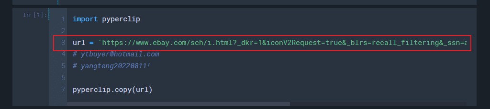
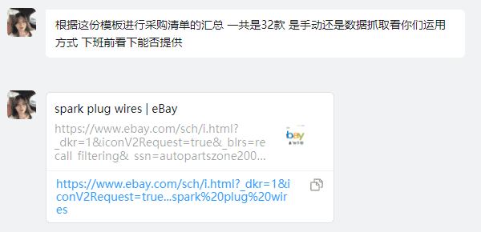
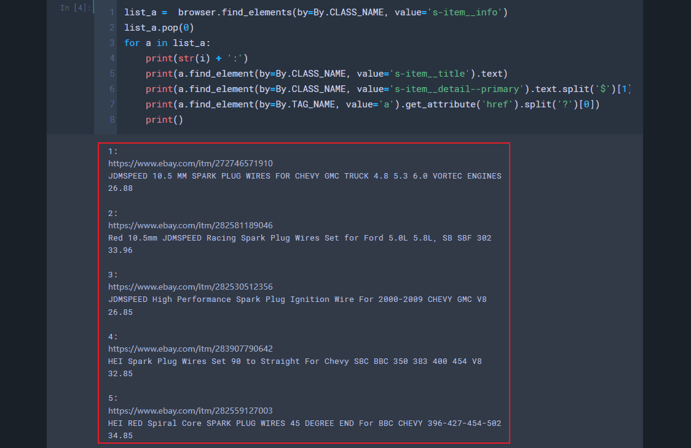
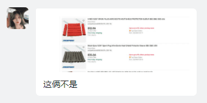
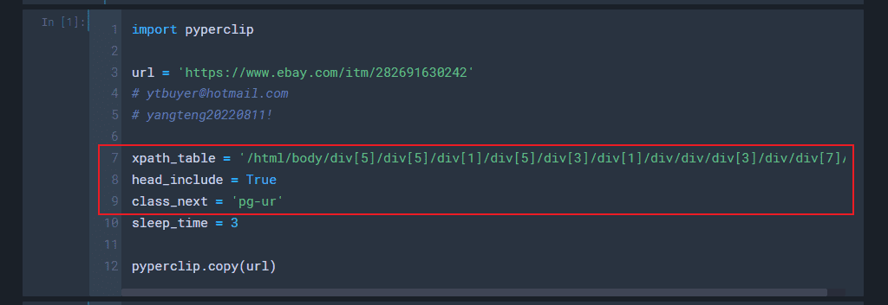
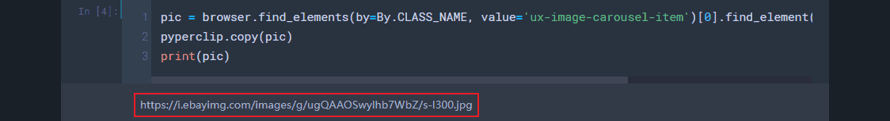
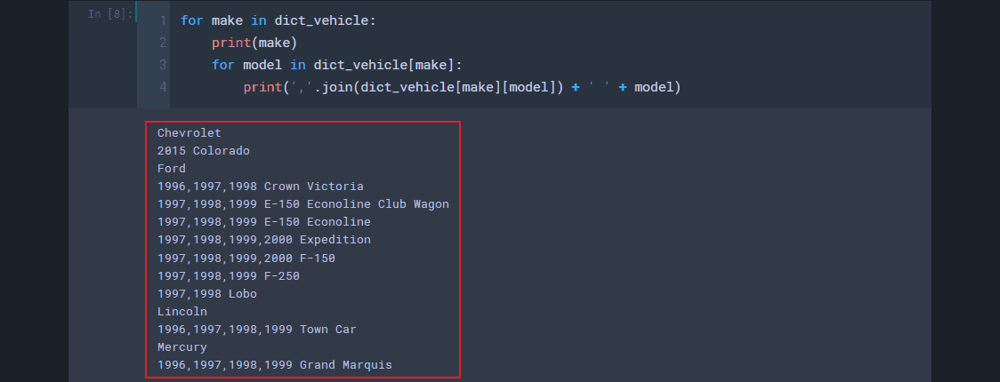

# 采购清单（Update: 2023.01.09）
## 0. 流程及注意事项
1. 从搜索页获取所有想要爬取的产品链接
2. 在各个产品链接内获取所需要的信息
3. 其他注意事项：
    - `中文品名`列和`英文品名`列根据实际进行修改，`备注`列根据实际需求填写
    - Excel内容不要有超链接
    - 有图行单元格行高设置为40，无图行设置为16.5

## 1. 产品链接
1. 把`url`改成自己要爬取的链接
    - 
    - 
2. 输出：产品链接、标题、售价
    - 
3. 根据实际情况忽略不符的产品
    - 

## 2. 产品详情
1. 把`url`改成具体的产品链接
    - 
2. 根据实际情况，调整网页表格的其他参数（暂时未发现需要更改）
    - 
3. 输出：图片链接、车型
    - 
    - 