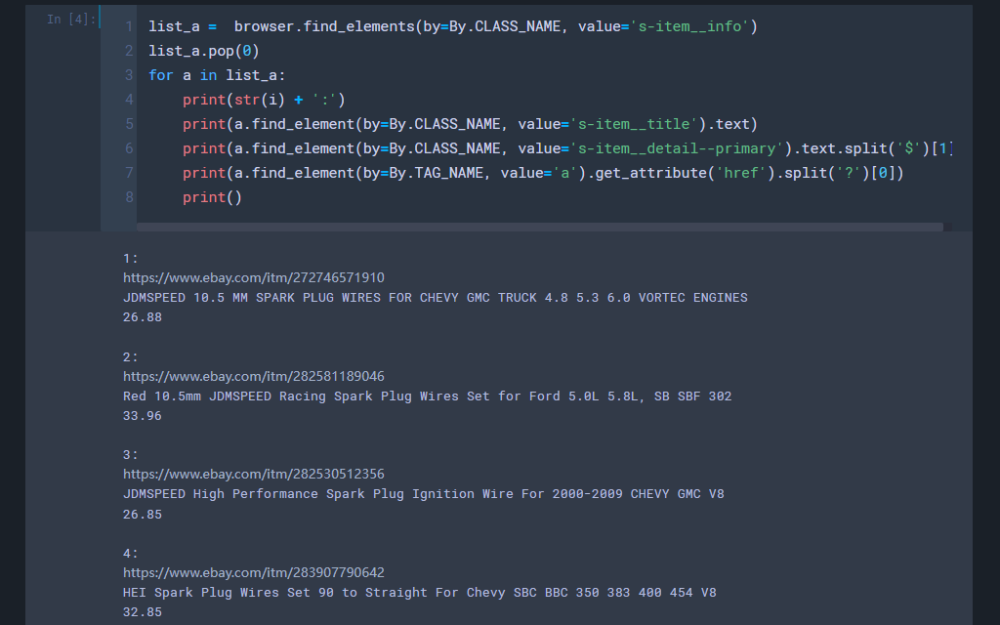

# 采购清单（Update: 2023.01.09）
## 1. 产品链接
1. 把`url`改成自己要爬取的链接
    - 
    - 
2. 根据实际情况忽略不符的产品
    - 
    - 
3. 输出：
    - 链接；标题；售价

## 2. 产品详情
1. 把`url`改成具体的产品链接
    - 
2. 根据实际情况，调整网页表格的其他参数（暂时未发现需要更改）
    - 
3. 输出：
    - 图片链接；车型

## 3. 继续
- 手动获取：
    - 品牌；品牌号；OE；位置；销量；备注