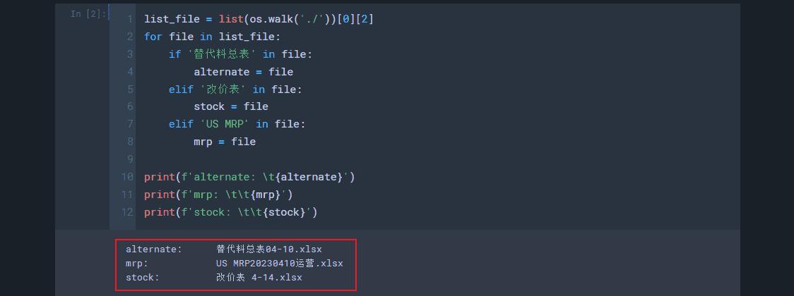
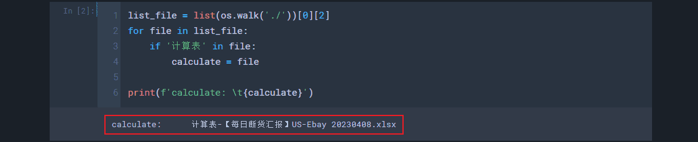
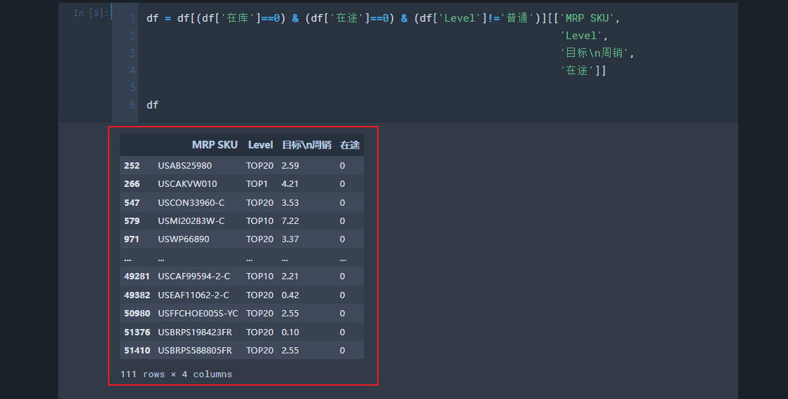
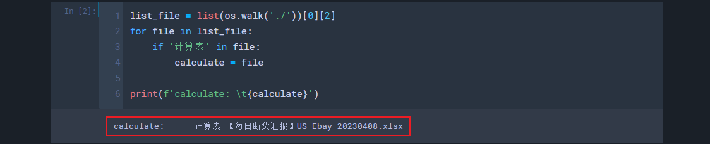

# 断货汇报（Update: 2023.03.06）
## -1. 公式
1. `1_断货数据分析`
    - |列|公式|
      |:-:|:-|
      |`在库为0（断货数）`| = `在库`[0] - `清仓`&`在库`[0] - `新品`&`在库`[0] - `新品成长`&`在库`[0]|
      |`在库1-2（干预数）`| = `老品`&`在库`[1] + `断货`&`在库`[1] + `断货成长`&`在库`[1] + `老品`&`在库`[2] + `断货`&`在库`[2] + `断货成长`&`在库`[2]|
      |`近期海运上架后断货数`| = `老品`&`在库+海运上架数`[0] + `断货`&`在库+海运上架数`[0] + `断货成长`&`在库+海运上架数`[0]|
      |`断货无在途`| = `在库`&`在途`[0] - `清仓`&`在库`&`在途`[0] - `新品`&`在库`&`在途`[0] - `新品成长`&`在库`&`在途`[0]|
      |`干预无在途`| = `老品`&`在库`[1]&`在途`[0] + `断货`&`在库`[1]&`在途`[0] + `断货成长`&`在库`[1]&`在途`[0] + `老品`&`在库`[2]&`在途`[0] + `断货`&`在库`[2]&`在途`[0] + `断货成长`&`在库`[2]&`在途`[0]|

## 0. 流程及注意事项
1. 修改`计算表`文件名中的日期
2. 把`新老品在途管控表`（`海运表`）的`US. 在途明细-总表`复制到`计算表`的`海运表到xx-xx`，并修改`海运表到xx-xx`对应的日期
3. 运行`库存表生成`，获取`整理好的库存表`
4. 把`整理好的库存表`复制到`计算表`的`附2_库存表`
5. 更新`计算表`的`附_1统计源（含新品、清仓、新品成长）`
    - 更改顶部的日期
    - `在库`列使用`整理好的库存表`的`库存`，`近期海运上架`列和`在库+海运上架数`列是公式，其余内容从`MRP表`复制
    - 修改右上角公式所用的单元格区间
6. 运行`断货SKU筛选`，获取`筛选好的断货SKU`
7. 更新`计算表`的`2_断货SKU`
    - 更改顶部的日期
    - 把`筛选好的断货SKU`的内容复制进来
    - 按`层级`列和`SKU`列升序排序
    - 拉取`品类`列的公式
    - 更新`品类去重`列
    - 按`断货数`列降序、`品类去重`列升序排序
8. 更新`计算表`的`1_断货数据分析`
    - `表3`的第一列删掉，其余内容整体向前提一列，最后一列填充`1_断货数据分析`的`D`列数据
    - 检查`表4`的`品类`列是否需要更新（与`附_1统计源（含新品、清仓、新品成长）`保持一致）
    - `表4`按`断货SKU数量`列降序、`总SKU数`列和`品类`列升序排序
9. 写邮件
10. 运行`邮件数据核对`，根据结果核对邮件内容
11. 其他注意事项：
    - 每周汇报两次：`海运表`Light每周更新一次、`替代料表`~~Chen老师~~Light每周更新一次、`MRP表`~~Chen老师~~Keira每周更新一次、`改价表`~~Chen老师~~Yana每天更新一次
    - 确保邮件内容的`周数和日期`正确
    - 邮件记得带附件

## 1. 库存表生成
1. 确认能自动识别`替代料表`、`改价表`和`MRP表`
    - 
2. 输出：`整理好的库存表`
    - 

## 2. 断货筛选
1. 确认能自动识别`计算表`
    - 
2. 输出：`筛选好的断货SKU`（`计算表`的`附_1统计源（含新品、清仓、新品成长）`中`在库`列和`在途`列都是`0`且`Level`列不是`普通`的行）
    - 

## 3. 邮件数据核对
1. 把`计算表`的路径进行修改
    - 
2. 输出：邮件内容关键数据