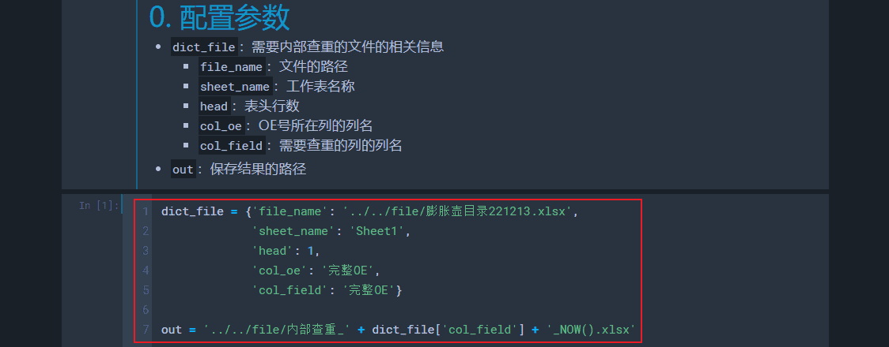
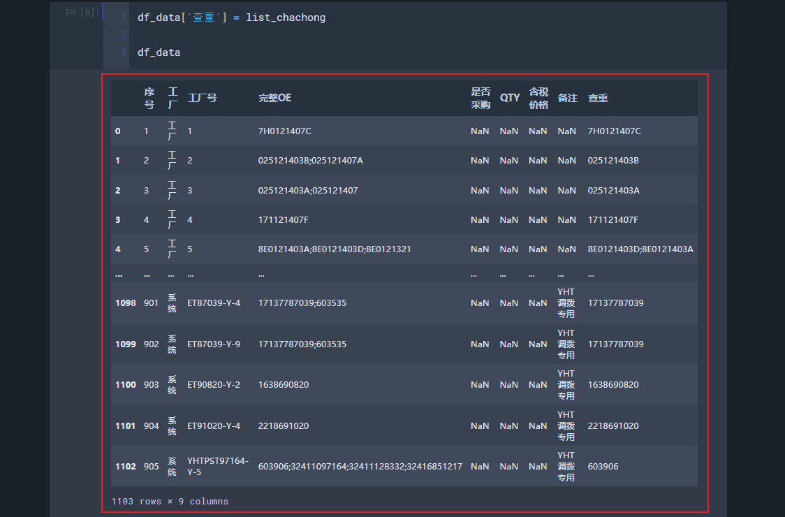
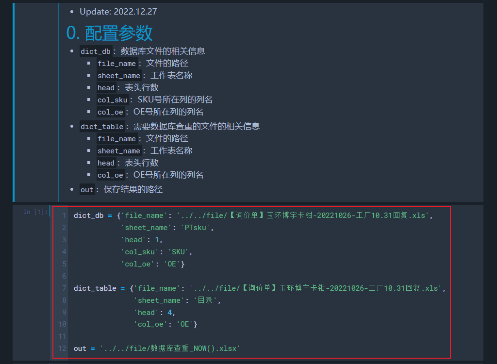
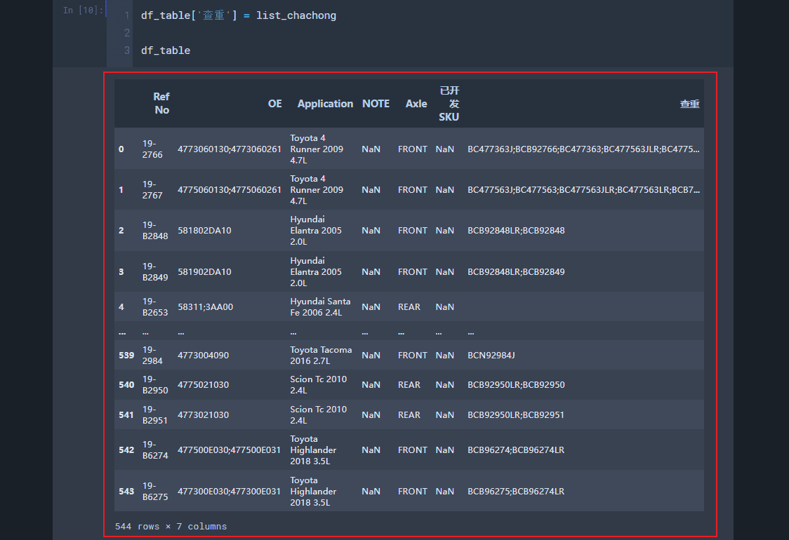

# 查重（Update: 2022.12.27）
## 0. 流程及注意事项
1. 其他注意事项：
    - `内部查重`操作和`数据库查重`操作没有关联，可以只执行其中一个操作，都执行时不分先后顺序
    - 由于数据格式不统一，查重操作不能达到100%完美，需要根据经验不断更新迭代

## 1. 内部查重
1. 把需要查重的文件的相关信息和结果的保存路径按实际需要进行修改
    - 
2. 输出：带有内部查重结果的文件
    - 

## 2. 数据库查重
1. 把需要查重的文件的相关信息、数据库相关信息和结果的保存路径按实际需要进行修改
    - 
2. 输出：带有数据库查重结果的文件
    - 