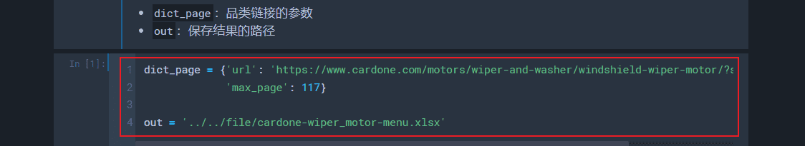
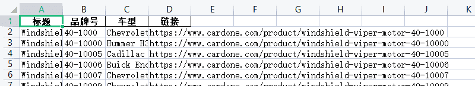
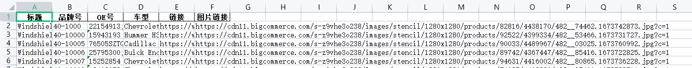

# Cardone爬虫（Update: 2023.02.11）
## 0. 流程及注意事项
1. 从给定的品类链接获取所有想要爬取的产品链接
2. 在各个产品链接内获取所需要的信息

## 1. 产品链接
1. 把`dict_page`改成自己要爬取的链接和最大页数
    - 
2. 输出：标题、品牌号、车型、链接
    - 

## 2. 产品详情
1. 把`dict_menu`改成之前输出好的文件
    - 
2. 输出：标题、品牌号、OE号、车型、链接、图片链接
    - 