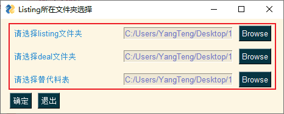
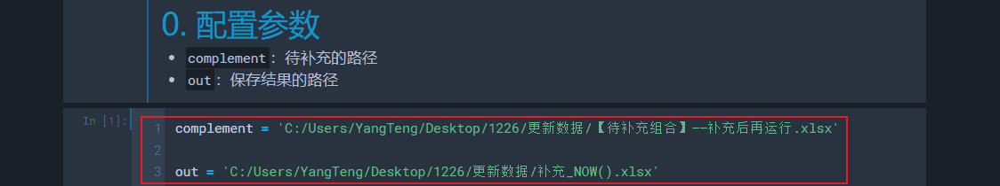
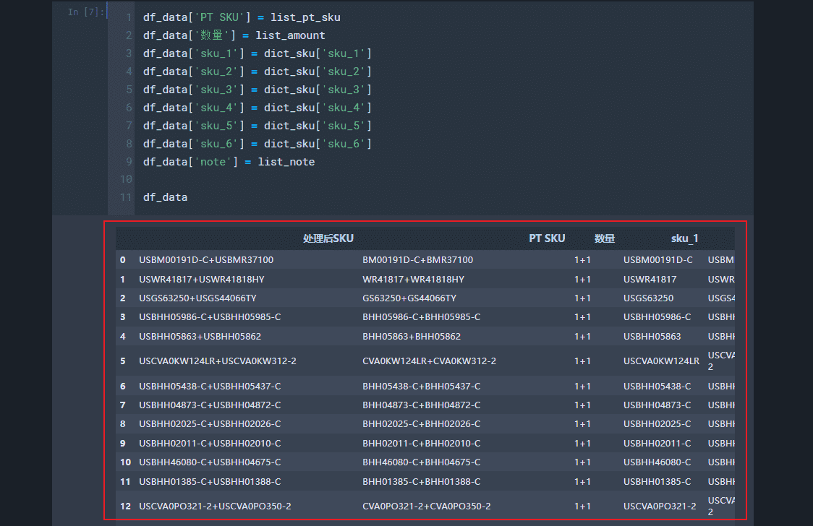
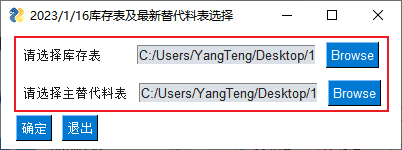

# 在线监控（Update: 2023.01.04）
## 0. 流程及注意事项
1. 调整`listing`表，只保留`ItemID`、`Seller`、`主SKU`、`SKU`、`售价`、`刊登方式(天)
`和`在线数量`7列
2. 把运营的`替代料总表`转化成代码可用的`替代料总表`
3. 运行`在线监控`的代码片段1~41，获取`待补充组合`
4. 运行`待补充处理`，并将结果复制到代码可用的`替代料总表`的`MRP外SKU`
5. 拉取代码可用的`替代料总表`的公式，并设置好相应的单元格格式
6. 根据`重复检查`单元格的提示，确定是否需要核对
    - 核对操作需要对`检查列`根据单元格背景颜色`粉色`进行筛选，将排名靠前的SKU复制到排名靠后的SKU的`替换料`列中，并将排名靠前的SKU所在行删除
7. 重新运行`在线监控`的代码片段1~41，确保新输出的`待补充组合`为空
8. 运行`US库存匹配`，获取`库存表`
9. 重新运行`在线监控`
10. 其他注意事项：
    - 注意`待补充处理`代码的输出，`note`列如果有信息则需要手动修改SKU
    - 各种判定标准在最终的监控文件模板中

## 1. 在线监控
1. 选择`listing`和`活动`文件夹和代码可用的`替代料总表`文件的路径
    - 
2. 选择`利润表`、`MRP表`和`库存表`文件的路径
    - 
3. 输出：`在线listing监控`表

## 2. 待补充处理
1. 把需要处理的待补充文件和结果的保存路径按实际需要进行修改
    - 
2. 输出：处理好的待补充表
    - 

## 3. US库存匹配
1. 选择`改价表`和代码可用的`替代料总表`文件的路径
    - 
2. 输出：`库存表`