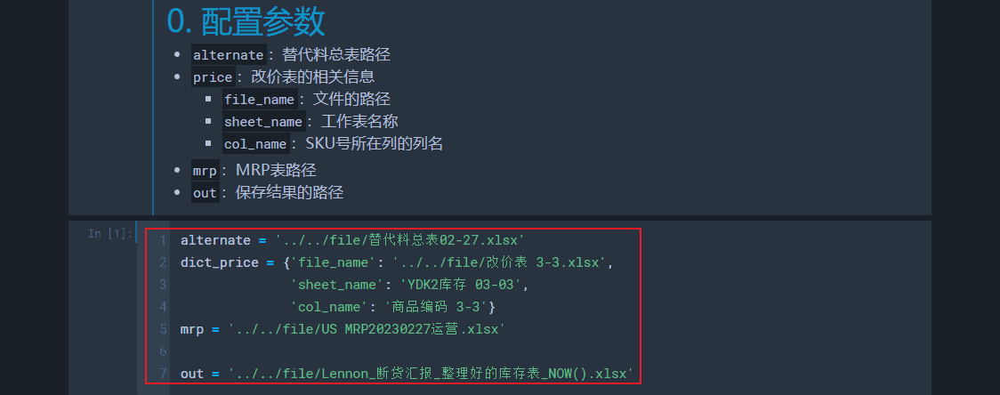
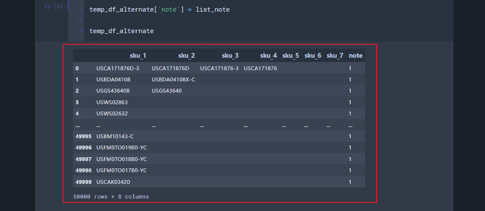
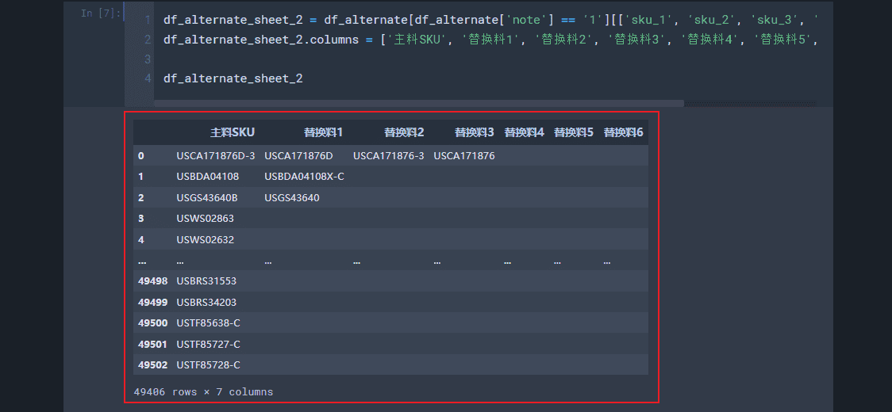
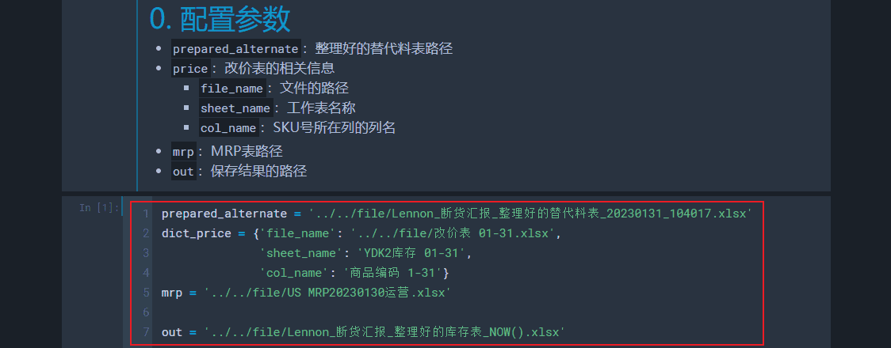
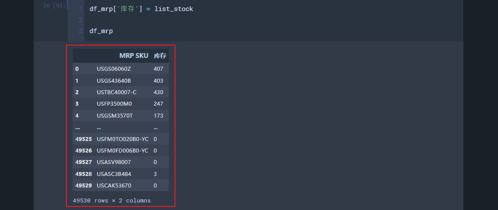
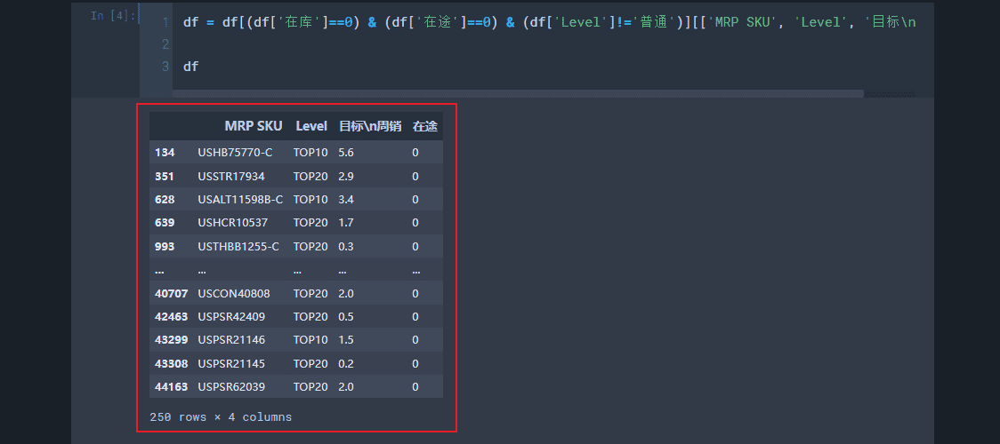
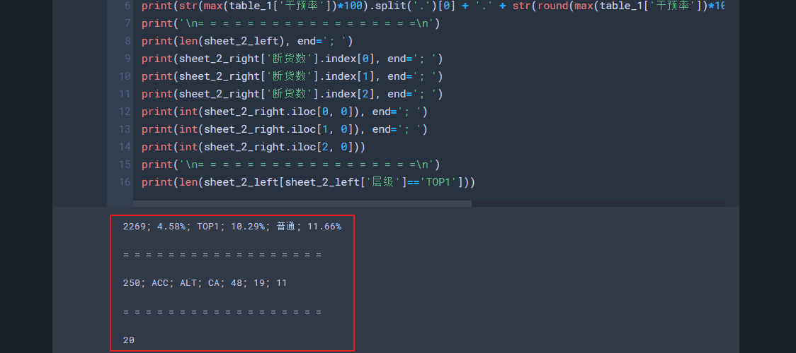
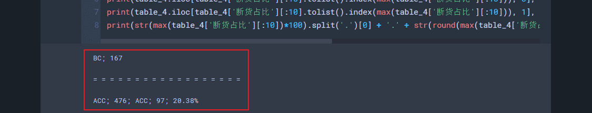

# 断货汇报（Update: 2023.01.31）
## 0. 流程及注意事项
1. 修改`计算表`文件名中的日期
2. 把`新老品在途管控表`（`海运表`）的`US. 在途明细-总表`复制到`计算表`的`海运表到xx-xx`，并修改`海运表到xx-xx`对应的日期
3. 运行`替代料表整理`，获取`整理好的替代料表`
4. 运行`库存表生成`，获取`整理好的库存表`
5. 把`整理好的库存表`复制到`计算表`的`附2_库存表`
6. 更新`计算表`的`附_1统计源（含新品、清仓、新品成长）`
    - 更改顶部的日期
    - `在库`列使用`整理好的库存表`的`库存`，`近期海运上架`列和`在库+海运上架数`列是公式，其余内容从`MRP表`复制
    - 修改右上角公式所用的单元格区间
7. 运行`断货SKU筛选`，获取`筛选好的断货SKU`
8. 更新`计算表`的`2_断货SKU`
    - 更改顶部的日期
    - 把`筛选好的断货SKU`的内容复制进来
    - 按`层级`列和`SKU`列升序排序
    - 拉取`品类`列的公式
    - 查看`品类去重`列是否需要更新
    - 统计`断货数`列（统计后粘贴为数值，不要保留公式）
9. 更新`计算表`的`1_断货数据分析`
    - `表3`的第一列删掉，其余内容整体向前提一列，最后一列填充`1_断货数据分析`的`D`列数据
    - 检查`表4`的`品类`列是否需要更新（与`附_1统计源（含新品、清仓、新品成长）`保持一致）
    - `表4`按`断货SKU数量`列降序、`总SKU数`列和`品类`列升序排序
10. 写邮件
11. 运行`邮件数据核对`，根据结果核对邮件内容
12. 其他注意事项：
    - 每周汇报两次：
        - 周二，上周`海运表`、上周`替代料表`、新`MRP表`（Chen老师）和新`改价表`（Chen老师）
        - 周五，新`海运表`（Light）、新`替代料表`（Chen老师）、本周`MRP表`和新`改价表`（Chen老师）
    - 确保邮件内容的`周数和日期`正确
    - 邮件记得带附件

## 1. 替代料表整理
1. 把`替代料表`、`MRP表`和输出文件的路径进行修改
    - 
2. 输出：`temp替代料表`和`整理好的替代料表`，其中`temp替代料表`的`note`列记录了哪些sku存在于`MRP表`中，`整理好的替代料表`是对`temp替代料表`的进一步整理
    - 
    - 
3. 从`temp替代料表`到`整理好的替代料表`的变形过程：
    - `note`列为`1`的行直接使用，为`2`、`3`、`4`、`5`、`6`或`7`的行使用主元法
    - `note`列为`1;2`或`1;3`，先查重`sku_2`或`sku_3`（已经存在于前述操作的结果中就舍去，不存在就新添加），再去除这个SKU并使用其他全部
    - `note`列为`1;4`、`1;5`等与上述操作类似，为`2;3`、`3;4`、`1;2;3`等需要重改代码，在实际中出现时应更新代码或手动处理后续操作

## 2. 库存表生成
1. 把`整理好的替代料表`路径、`改价表`相关信息、`MRP表`和输出文件的路径进行修改
    - 
2. 输出：`整理好的库存表`
    - 

## 3. 断货SKU筛选
1. 把`计算表`和输出文件的路径进行修改
    - 
2. 输出：`筛选好的断货SKU`（`计算表`的`附_1统计源（含新品、清仓、新品成长）`中`在库`列和`在途`列都是`0`且`Level`列不是`普通`的行）
    - 

## 4. 邮件数据核对
1. 把`计算表`的路径进行修改
    - 

2. 输出：邮件内容关键数据
    - 
    - 
    - 
    - 