# OT（Update: 2023.01.14）
## 0. 流程及注意事项
1. `Ref No.#列`
    - 复制`OE号`到[RockAuto](https://www.rockauto.com/en/partsearch/)，将可能遗漏的`dorman号`补充进去
2. `Description列`
    - 复制`品牌号`到[PartsGeek](https://www.partsgeek.com/)查看车型，填写规范参考“新品开发两大表流程图.png”
    - 注意：
        - 选择年份涵盖最久的车型将其车型和年份写在最前面
        - 此列的内容有长度限制，不要填写全部车型，只挑选热卖的几个
3. `Weekly Qty列`
    - 网页设置参考“新品入门操作注意事项-基于RFQ.docx”，挑选3~5个链接计算平均最高周销
4. `Reference Link列`
    - 填写销量最高的链接
5. `Suggested Price列`
    - 参考市场最低价，利润率保持在15%~25%，最低接受-10%
    - 注意：
        - 比较价格时要算上运费
        - 只比较`Brand New`，忽略二手产品
6. `Exchange Rate列`
    - 按照主市场确定，us：6.5，欧洲：6.8
7. 其他注意事项：
    - 外饰件在填写Amazon市场的时候，只写在`Amazon-YHT列`
    - Amazon <= eBay
    - ca市场参考us，且除去2000年之前和稀有车型
    - au和uk市场投入量较少
    - 注意`QTY列`的数量规范

## 1. 车型
1. 复制`品牌号`到[PartsGeek](https://www.partsgeek.com/)并搜索
    - 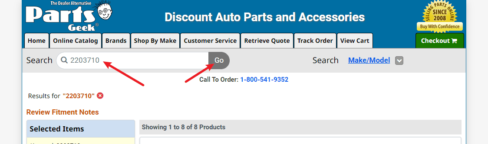
2. 按`F12`，复制网页代码（网站的反爬机制太强了）
    - 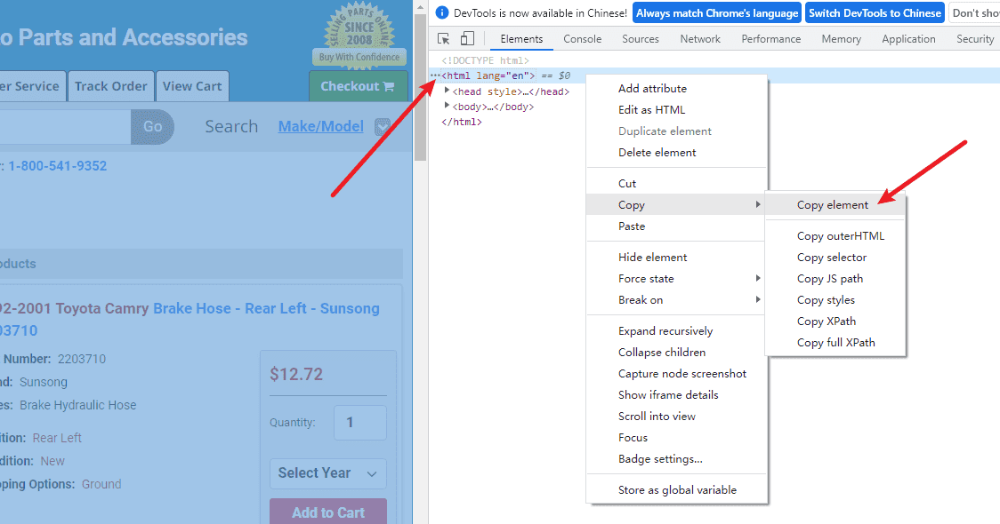
3. 把`html`改成复制好的网页代码
    - 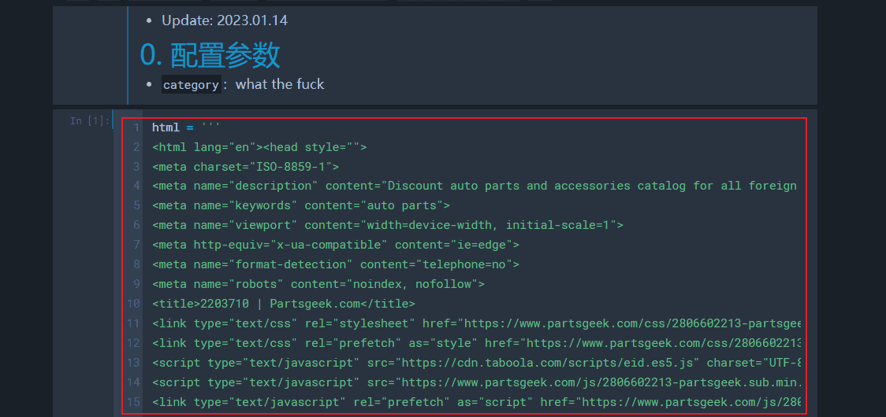
4. 确认`auto`的值为`True`
    - 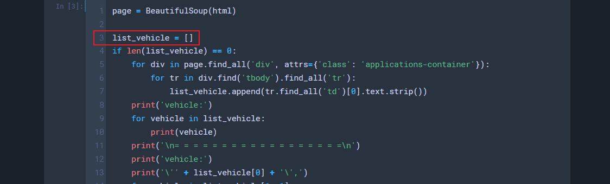
5. 运行所有代码，得到网页所有车型
    - 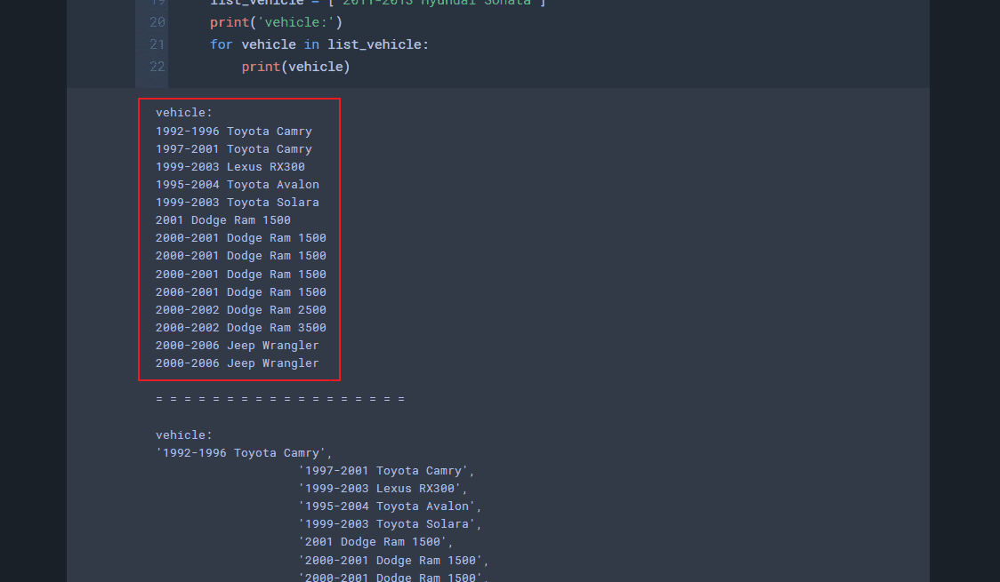
6. 根据实际情况，只复制目标产品对应的车型，然后将`auto`的值改为`False`并重新运行所有代码
    - 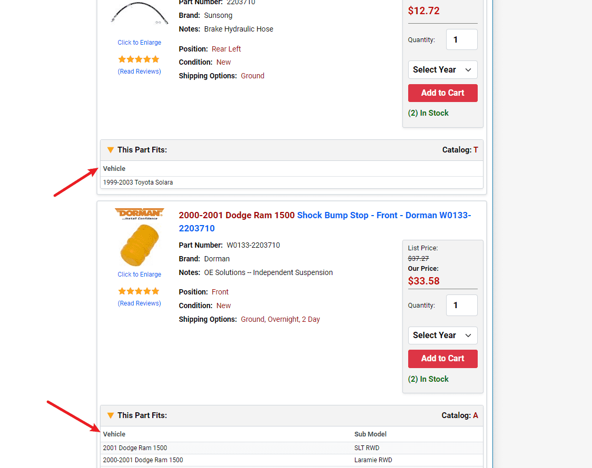
    - 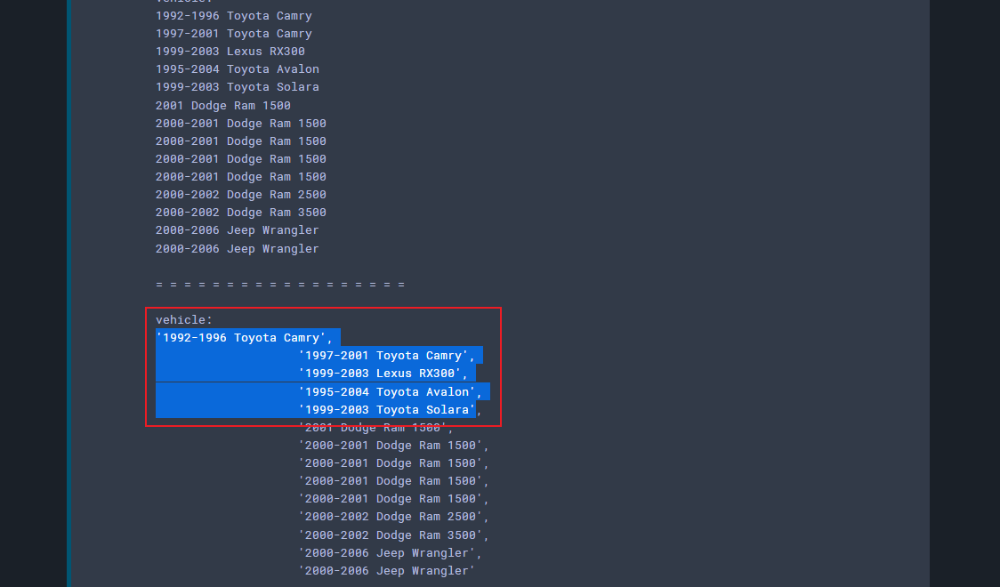
    - 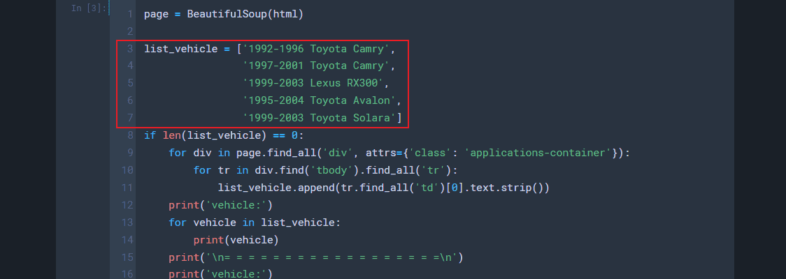
7. 输出：`make + model + year`格式的车型
    - 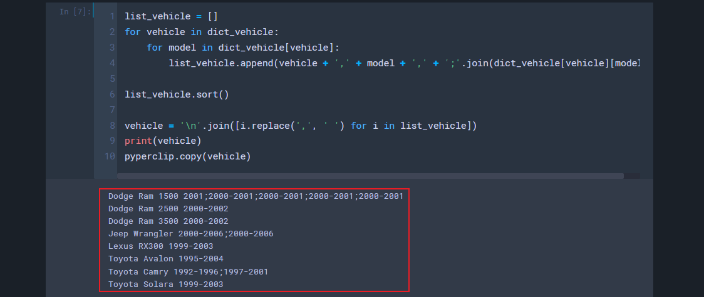

## 2. Description
1. 复制车型信息并手动调整顺序，然后根据实际修改`category`和`note`
    - 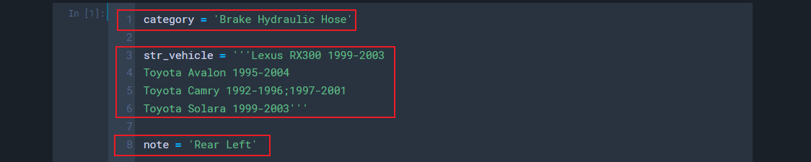
2. 输出：符合规范的Description
    - 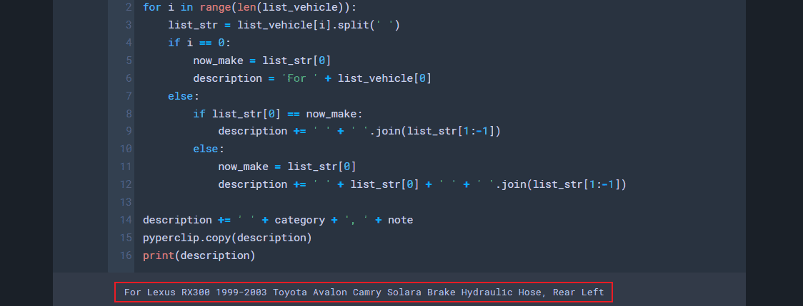